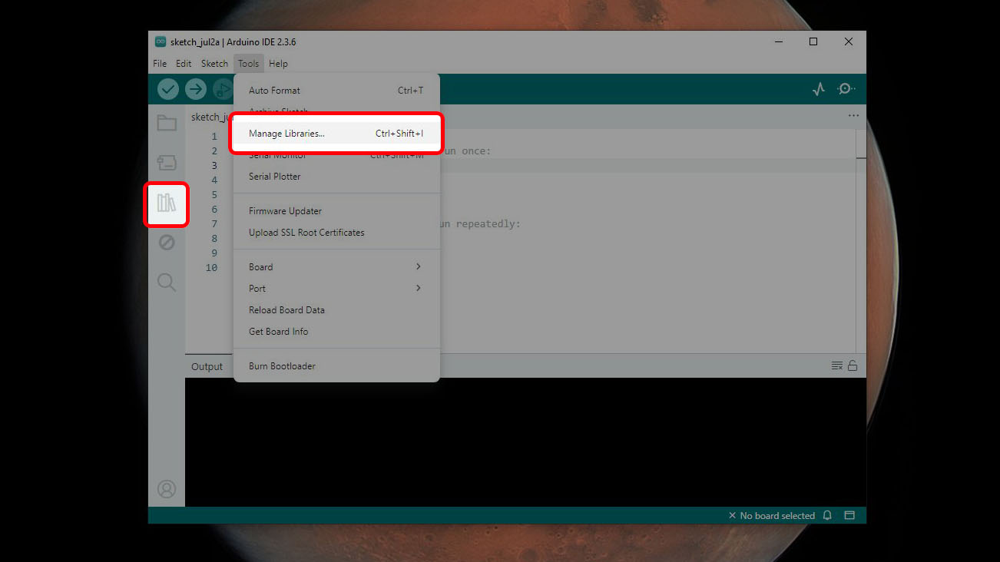
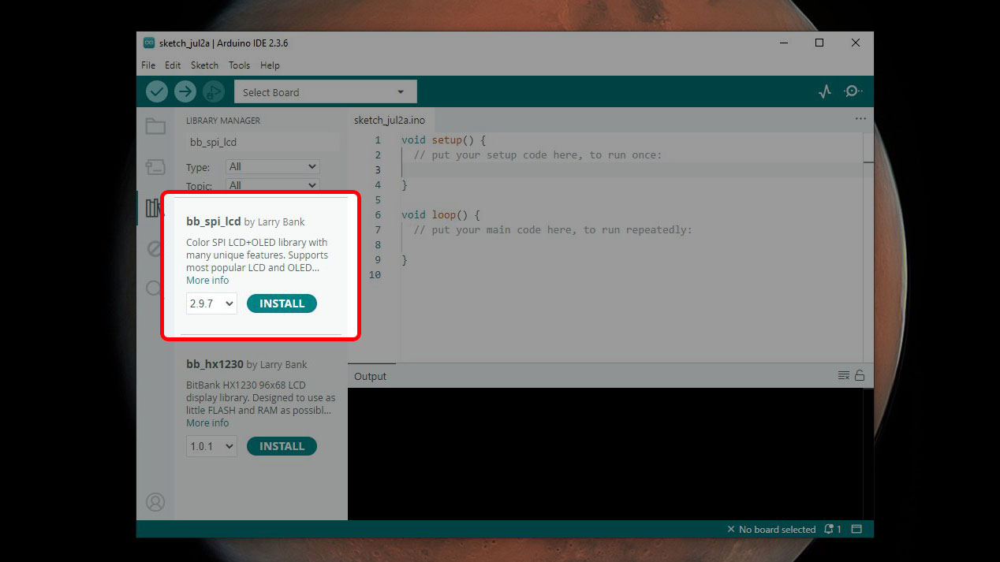

# ESP32 CYD for beginners
A record of my journey with the CYD that I'm making to help others who don't know a lot about hardware

Given the community that's growing up around the ESP32 CYD, I thought it was good idea to make a guide for absolute beginners who have very limited programming knowledge but still want to dive in and make something. Many tutorials and guides take the form of code examples that you're expected to copy and paste which works great for people with experience programming in C++, but not so much for every one else. 

## What is the ESP32 Cheap Yellow Display (CYD)?

The CYD is an ESP32 microcontroller with a built in 2.8-inch, 320 × 240 touch display (about 43 × 57 mm or 1.7 × 2.25 in). You can pick one up (or a close imitator) for anywhere from $10 to $25 depending on how you get it with AliExpress being the cheapest and Amazon being the most expensive.

Besides incorporating a display directly with the microcontroller, the CYD also has Wi-Fi, Bluetooth, USB input, an SD card slot, and a bunch of GPIO pins you can play with. Coupled with its low price, that makes the CYD a great value, especially for people who just want to make stuff.

## What software do you need?

### CH340 Driver

First, you need to make sure you have a driver for the CH340 chip the CYD uses to allow communication between it and your computer via a USB connection. If you're using a Windows machine, an easy way to see if you have this driver is to plug in your CYD and see if it shows up in your Device Manager. If you have the driver installed it should appear under `Ports (COM & LPT)` as `USB-SERIAL CH340 (COM##)`. 

If you don't have the driver installed, you'll have to get it. The easiest way to grab it is from [SparkFun's website](https://learn.sparkfun.com/tutorials/how-to-install-ch340-drivers/all) which also has the drivers Mac and Linux as well as some troubleshooting steps if you run into any issues.

### IDE

To write programs for your CYD, you're going to need a special bit of software called an integrated development environment. There are lots of options out there to choose from, but the Arduino IDE is one of the easiest to use and is purpose built for working with hardware projects. Download the software [directly from Arduino](https://www.arduino.cc/en/software/) and install it on your computer.

#### Boards Manager

Once Arduino is installed and open on your computer, you need to install the necessary files to work with your CYD which can be done from the Boards Manager. To get there either click the icon at the left of the Arduino window, click on Tools > Board > Boards Manager in the menu, or press <kbd><kbd>Ctrl</kbd> + <kbd>Shift</kbd> + <kbd>B</kbd></kbd>. 

Once the Boards Manager is open (it will be a column on the left side of the window) search for "esp32". A couple of options should show up, find the one called `esp32` and click `INSTALL`. This process can take a couple of minutes so be patient.

#### Library Manager

At this point you are just about ready to dive into the examples, but first you need learn how to install libraries. Libraries are packages of commands that give you extra functionality. When you installed the ESP32 board just a minute ago, that had a number of so-called standard libraries that will let you do things like access Wi-Fi and Bluetooth which are common on ESP32 chips. But since our goal is to make use of the CYD display, we're going to need a library to make using the display easier. To access the Library Manager in Arduino either select the icon on the left of the window, click Tools > Manage Libraries in the menu or press <kbd><kbd>Ctrl</kbd> + <kbd>Shift</kbd> + <kbd>I</kbd></kbd>.

The Library Manager will open on the left side of your window just like the Boards Manager did. There are lots of display libraries to choose from, but we're going to start with one that's a little bit simpler to set up. In the Library Manager search bar, search for "bb_spi_lcd". This should install much faster than the board you just installed.

With all that taken care of, you're ready to [start programming](example-programs/README.md) the CYD!