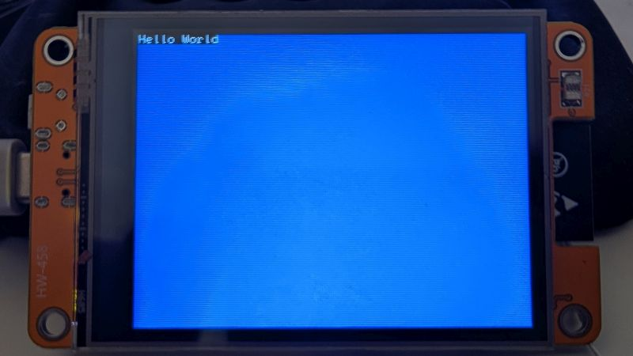

Okay, you have a "Hello World" program up and running on your CYD, but it's kind of ugly, so let's see what else the BB_SPI_LCD library can offer us to make our program a bit more pretty.

The first thing we can do is use the `fillScreen()` method to fill our display with a more pleasing color instead of the actinic bars of our current program. 

```c++
lcd.fillScreen(TFT_BLUE);
```

Put this line right after the `begin()` method. It will mellow out the harsh of the display.

That looks much better but you have a new problem: The background color of your text defaults to black and it totally clashes with the blue background fill. 



To fix this you could set pass <var>TFT_BLACK</var> to `fillScreen()` but what if you *really* wanted that blue background. Thankfully, BitBank already has a solution. Remember the `setTextColor()` method? You can pass a second argument to it to set the background color of the text. If you omit the second argument it will default to a black background but you can set it to whatever you want. Let's set our text background color to blue like our display fill and set our text to yellow so it pops a bit.

```c++
lcd.setTextColor(TFT_YELLOW, TFT_BLUE);
```


Things are starting to look better, but we can do more. For one thing, the font is really small. This is an easy fix with the `setFont()` method. `setFont()` can take one of five arguments that will determine the font. The library has five constants built in to make it clearer which font you're using. You could just use the numbers 0–4, but using the constants makes your code more readable.


That 12 by 16 font looks sharp, let's go with that one.

```c++
lcd.setFont(FONT_12x16);
```

This is fine, but it would look better if the text were centered. The BB_SPI_LCD library doesn't have a built-in method to center text, so we'll have to do it ourselves. There are four things we need to do this: 
1. The `setCursor()` method which lets you determine from which pixel on the display your text will be written.
2. The width in pixels of your display. Since you're using a CYD you know that's either 320 or 240.
3. The number of characters in your string. There are 11 characters in the string "Hello World".
4. The width in pixels of your font. 

We know our font is 12 pixels wide. The fonts included in this library are monospaced, meaning each glyph takes up an equal amount of screen real estate. Our string is 11 characters long, so that means our string takes up 132 pixels. If we moved our cursor to pixel 160 on the x axis in the middle of the screen our text would begin from there, so the trick is to offset the pixel to the left by half the length of our string, 66 pixels. That means we need to move our cursor to pixel 160 - 66, or 94.

```c++
lcd.setCursor(94, 0);
```


If you're feeling adventurous you could set all of that up programatically so that the computer does the math for you.

If we want to center the text vertically, we have to do similar math. Our font is 16 pixels high and only takes up one line. The middle of the y axis on the CYD is 120 pixels. Offset that position by half of our pixel height to get our vertical center point. 120 - 8 = 112

```c++
lcd.setCursor(94, 112);
```

