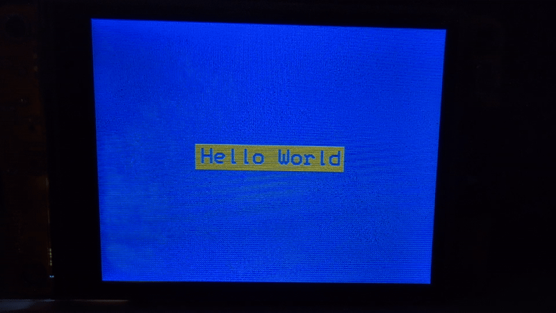
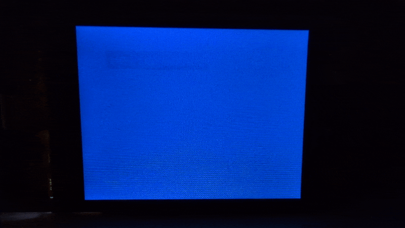
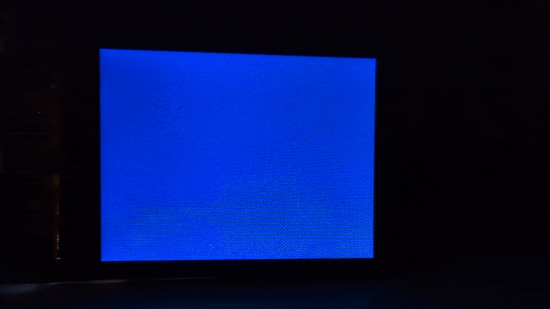
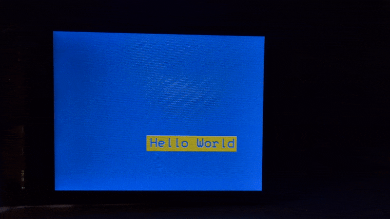

# Hello Loops

Loops are foundational to programming. If you want something to move across your screen, you'll need a loop of some sort to run while your something is moving. If you want to process human input, you'll need to idly loop while waiting for that input. So let's dive in and start playing with the `loop()` function that the Arduino IDE insists upon.

> [!NOTE]
> If you don't know what scope is, you should take this sidequest; otherwise, read on!

Whereas the `setup()` function runs only one time when the program starts, the `loop()` function starts running over and over as soon as the `setup()` function finishes with its last command. Let's use that loop to do some fun things with our "Hello World" program. How about we start by making our text and box blink.

When writing a program, it's best to think about the individual steps you need to take to achieve your goal. Our goal is to put some text on the screen (we've already done that), remove it, then put it back again, over and over. Since we already put our text on the screen in the `setup()` function, we'll start our loop by removing it.

There's not a function to remove text or rectangles from the screen so we're going to have to cover it up. Let's go nuclear and just use `fillScreen()` again.

```c++
lcd.fillScreen(TFT_BLUE);
```

Put this line inside your `loop()` function.

Next, we have to put the text back. You already have the text to do that. You don't need to reuse the `setTextColor()` or `setFont()` methods, but you will need to reuse the other methods.

```c++
lcd.fillRect(90, 108, 140, 24, TFT_YELLOW);
lcd.setCursor(94, 112);
lcd.println("Hello World");
```

You could compile and upload the program just like this, but you'll see that that the text and box are just flickering, not really blinking. What we need is a way to delay the transition between the two states. Thankfully, because you're using Arduino IDE, you have access to a few very useful functions. One of those is `delay()` which simply forces your program to wait for a set number of milliseconds before running again. Let's set our delay to 250 milliseconds so our screen will change state every quarter second. Put one `delay()` before `fillScreen()` and one delay after, but before our `fillRect()`, `setCursor()`, and `println()`.

```c++
delay(250);
```



Let's get weird and instead of the text blinking in the same spot, let's have it reappear in a random spot. To make this magic happen we'll need another one of those Arduino functions: `random()`. This function can either take one or two arguments. If you pass just one argument, `random()` will give you a random number between 0 and one less than the number you passed to it. If you give it two arguments, the first will be the inclusive lower bound of the potential number output, and the second will be the exclusive upper bound. 

We want our text to appear on a random position on the screen, so we will need to generate two random numbers: one for the x position and one for the y position. We also have to decide how big our range of random numbers will be. If we want the totality of our text and box to always be displayed we're going to have to plan accordingly (and do a little bit of math). 

Let's start with our x value. We know that all together, our text and box are 140 pixels wide, so if we render them any closer than 140 pixels to the right edge of the screen, not all of it will be displayed. Knowing that, we can set our maximum to 320 (the screen width) - 140 (the box width), or 180. Our minum value is 0 so we only need one argument.

```c++
int x = random(180);
```

We can do some similar number crunching to get our maximum y value. The screen is 240 pixels tall and our box is 24 pixels tall, which means our maximum y value is 216. Our minimum y value is 0, the same as for x.

```c++
int y = random(216);
```

Insert these two lines at the start of your `loop()` function, but before you compile it, we need to make some changes to the arguments we are passing to the `fillRect()` and `setCursor()` methods. Remember that two of the arguments that `fillRect()` is expecting are the x and y values of the top-left corner. Let's pass along our new random variables.

```c++
lcd.fillRect(x, y, 140, 24, TFT_YELLOW);
```

Now you need to tell the text where to print. Recall that we made the rectangle 4 pixels wider and taller than our text on all four sides, so we need to offset our cursor position 4 pixels to the left of the rectangle's x value and 4 pixels down from the rectangle's y value.

```c++
lcd.setCursor(x + 4, y + 4);
```



Neat! `loop()` runs over and over, and every time it does, new x and y values are generated. 

Okay, this *is* neat, but the random blinking is a little hectic. Let's slow it down and make a transition effect for our text/box. What if, instead of blinking off, it disapeared row by row? It sounds fun. Let's do it. 

First, let's figure out what we want to do. Instead of using `fillScreen()` to wipe away our text and box, we want to cover it up one column at a time. Let's use `fillRect()` to cover it up with 1-pixel-wide rectangles. We could do this by filling our code with 140 `fillRect()` commands, or we could put a loop inside of our `loop()`. Specifically, a special type of loop that counts through a sequence of numbers called a for loop. It looks like this:

```c++
for (initialization; condition; increment) {
  ...
}
```

<var>`initialization`</var> establishes our first number. We could set this to be the left-most pixel of our rectangle but it might be easier to set it to 0 for now.

<var>`condition`</var> determines when we stop counting and end the loop. We want to stop our loop after it runs 140 times, the pixel width of our rectangle. In other words as long as our initial value is ≤140.

<var>`increment`</var> is by how much our initial value should change each iteration of the loop. Since we're going to be going column-by-column, left-to-right, we'll want this to be +1 each loop. 

Let's put all that together and see what it looks like.

```c++
for (int i = 0; i <= 140; i++) {
  ...
}
```

To figure out what we need to do in our loop, we need to better understand what the for loop is doing. The first iteration of the loop, the value of <var>`i`</var> is 0, but before anything runs, the loop checks to see if the <var>`condition`</var> is true. If it is, it runs the code between the curly braces, then it increments the <var>`i`</var> variable to 1, and the process repeats. It will repeat as long as <var>`i`</var> is less than or equal to 140. Once it increments past 140, the for loop will end. 

To figure out what code we need between the curly braces, think about what action we want to take 140 times. `fillRect()` Let's start plugging in values.

```c++
fillRect(?, ?, ?, ?, ?);
```

Some of these are easy. We know we want to draw our skinny rectangles to be the same color as our background.

```c++
fillRect(?, ?, ?, ?, TFT_BLUE);
```

We also know what size we want our skinny rectangles to be: 1 pixel wide and 24 pixels tall.

```c++
fillRect(?, ?, 1, 24, TFT_BLUE);
```

Now, we need to figure out the x and y position of the top of our 1-pixel rectangle. The y position will be the same as the y position randomly generated for our rectangle at the beginning of `loop()`.

```c++
fillRect(?, y, 1, 24, TFT_BLUE);
```

To figure out the x position we need to think about the changing value of <var>`i`</var> in our for loop and integrate that with the random <var>`x`</var> value we generated at the start of this `loop()`. We know the first skinny rectangle we want to draw should be at the <var>`x`</var> position and our initial <var>`i`</var> value will be 0, and the next one should be 1 pixel over and our <var>`i`</var> value will be 1, and the one after that should be 2 pixels over from the original and our <var>`i`</var> will be 2. Do you see the pattern?

```c++
fillRect(x + i, y, 1, 24, TFT_BLUE);
```

All together, your for loop should look like this:

```c++
for (int i = 0; i <= 140; i++) {
  lcd.fillRect(x + i, y, 1, 24, TFT_BLUE);
}
```

To get the effect we want, we'll have to modify our program a tad. Let's think about the flow of our program as it currently is.

1. In `setup()`, we initialize the screen, set up our text, and draw our box and text onto the display.
2. In `loop()`, we use `fillScreen()` to clear away our text, *then* we put our box and text somewhere random on the screen.

With our new logic, our flow is a little bit different.
1. In `setup()`, we still initialize the screen and our text, but because our for loop relies on the random <var>`x`</var> and <var>`y`</var> values we generate to "wipe" away our text, we can't draw any text until we have those values. Those values are generated in the `loop()` function, so that's where our text and box drawing have to be.
2. In `loop()`, since there's no text on screen we have to:
   1. get our random numbers,
   2. draw our box and text,
   3. and erase it with our for loop.

See if you can put that together yourself with the pieces we've laid out here, but if you get stuck, take a look at the [hello-world-wipe-blink.ino](hello-world-wipe-blink.ino) file to see one way of organizing this logic.



Honestly, this is still a little to busy for me. Let's stick another `delay()` *inside* the `for` loop to slow things down. Maybe just 2 millisecond?



Much better.