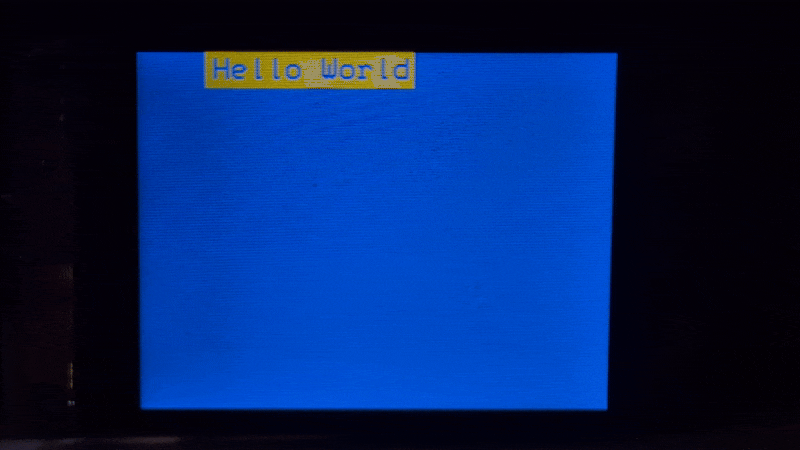
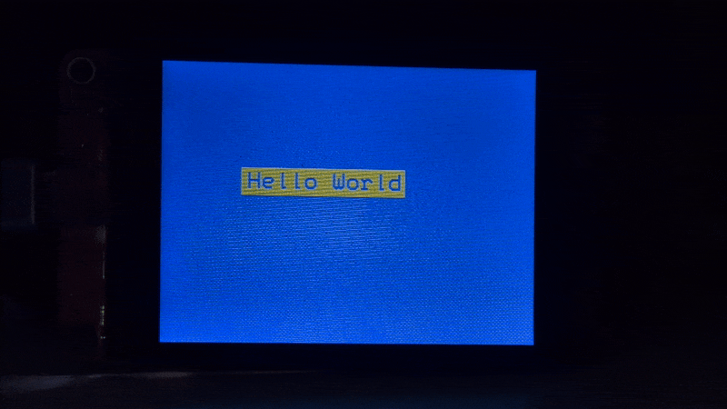
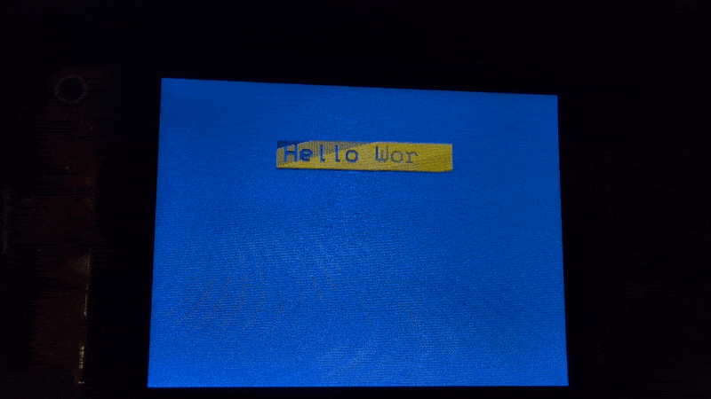

# Hello For Loops

So now you know what for loops are, let's play with them a bit more to see what kinds of things we can do with them.

That wipe erase was pretty cool, let's do it again, but from the other side! To pull this off, all we need to do is change up some of the details of our for loop. Let's start by thinking about what the for loop in the current [hello-world-wipe-blink.ino](../03-hello-loops/hello-world-wipe-blink.ino) file is doing.

It's drawing 140 (the length of the area we need to clear) 1 pixel by 24 pixel rectangles starting from the left edge of the rectangle (the randomly generated <var>`x`</var> value) to the right edge of the rectangle. Our job now is to do the same thing but from the right edge (<var>`x`</var> + 140) to the left edge (<var>`x`</var> + 0). Let's figure out what we need to put in our for loop logic.

```c++
for (int i = ?; i <?> ?; ?)
```

Since we're essentially working backwards from our previous for loop, we can probably just swap some of the values. For example, whereas our previous for loop ends at 140, our current for loop needs to start at 140.

```c++
for (int i = 140; i <?> ?; ?)
```

Again, our previous loop started at 0, this one needs to end at 0; in other words, our for loop should run as long as <var>`i`</var> ≥0.

```c++
for (int i = 140; i >= 0; ?)
```

Finally, instead of counting up from 0, our loop is counting down from 140, so we need to decrement by 1 each loop.

```c++
for (int i = 140; i >= 0; i--)
```

We should be able to drop this in to our previous code.

```c++
for (int i = 140; i >= 0; i--) {
  delay(2);
  lcd.fillRect(x + i, y, 1, 24, TFT_BLUE);
}
```



Neat. 

Let's go just one step further. How about we wipe it from both ends at the same time? You might think that you would need two for loops to achieve this, but there's a simpler way to do it. For loops can initialize and iterate two variables at the same time. We already know the numbers we're working with, so let's plug everything in.

Let's use <var>`i`</var> to draw our skinny rectangles from left to center and <var>`j`</var> to draw them from right to center. That means <var>`i`</var> will start at 0 and <var>`j`</var> will start at 140. We also know that <var>`i`</var> needs to count up, while <var>`j`</var> needs to count down. All that leaves is our condition. As long as our <var>`i`</var> value is no more than than half the length of our rectangle (140 / 2 = 70), the for loop should continue. Let's plug all of that into our new for loop.

```c++
for (int i = 0, j = 140; i <= 70; i++, j--)
```

We also have to draw two skinny rectangles per loop, one on each side of the area we're drawing over.

```c++
lcd.fillRect(x + i, y, 1, 24, TFT_BLUE);
lcd.fillRect(x + j, y, 1, 24, TFT_BLUE);
```



That's a neat effect, but let's switch gears and instead of removing our text box, let's move it. In particular, let's move it from the top of the screen to the bottom over and over. Think about what needs to be done in order to achieve this. 

* The text and box need to be drawn. 
* We need to remove our text box and we need to redraw it in a slightly different position. 
* And we need to change the direction of movement whenever the text box reaches the edge of the screen.

Knowing what needs to be done, and having all the knowledge you need to do it, see if you can work out how to do this on your own. If you need to follow along with my explanation, that's okay, but if you can make it work without the guide, share your solution and I'll share it in this README so others can see how many different ways there are to achieve the same outcome. 

> [!TIP]
> One of the easiest ways to code this is to use two for loops.

Based on our previous programs, we know that we need to use `fillRect()` to draw a box, `setCursor()` to pre-position our text, and `println()` to draw the text. Then we need a brief `delay()` which we need to follow up with overwriting it all and doing it again. We're going to do this the easy way and use two for loops, so let's start with the first one.

This first for loop is going to move our text box from the top of the screen to the bottom (this tells us what our initial value needs to be, under what conditions the for loop should continue, and whether our initial value should increment or decrement). And because our text box will only go up and down, we only need to change the value for one of the axes. Finally, since we don't want our text to go off screen, we need to modify the condition for our for loop. So what values do we need to put in?

```c++
for (int i = ?; i <> ?; ?) {
  lcd.fillRect(?, ?, 140, 24, TFT_YELLOW);
  lcd.setCursor(?, ?);
  lcd.println("Hello World");
  delay(1);
  lcd.fillScreen(TFT_BLUE);
}
```

<details>
  <summary>Show the answer</summary>

  ---
  ```c++
  for (int i = 0; i <= 216; i++) {
    lcd.fillRect(90, i, 140, 24, TFT_YELLOW);
    lcd.setCursor(94, i + 4);
    lcd.println("Hello World");
    delay(1);
    lcd.fillScreen(TFT_BLUE);
  }
  ```

  * `int i = 0` Because we're starting at the top of the screen, our initial value should be 0.
  * `i <= 216` The max height of the CYD screen is 240 pixels, but since our text box is 24 pixels high, we have to compensate for that in our condition.
  * `i++` We want to increment our initial value since we're progressing from 0 to 216.
  * `lcd.fillRect(90, i, 140, 24, TFT_YELLOW);` We're moving the box up and down so we want the <var>`y`</var> value of our text box to change, the <var>`x`</var> value can stay the same.
  * `lcd.setCursor(94, i + 4);` Likewise, we're going to be changing the <var>`y`</var> position of our text, but we need to offset it by 4 pixels so it's centered in the rectangle.
  * `delay(1)` Honestly, this can be any value you want.

  Hopefully all of that makes sense.

  ---
</details>

Now let's try our hand at the second for loop that will take our text back up the screen. We're going to do things in the same order, but the direction of movement is different, so we need to swap some of our values around. Try to make this loop on your own.

```c++
for (int i = ?; i <> ?; ?) {
  lcd.fillRect(?, ?, 140, 24, TFT_YELLOW);
  lcd.setCursor(?, ?);
  lcd.println("Hello World");
  delay(1);
  lcd.fillScreen(TFT_BLUE);
}
```

<details>
<summary>Show the answer</summary>

---
```c++
for (int i = 216; i >= 0; i--) {
  lcd.fillRect(90, i, 140, 24, TFT_YELLOW);
  lcd.setCursor(94, i + 4);
  lcd.println("Hello World");
  delay(1);
  lcd.fillScreen(TFT_BLUE);
}
```

* `int i = 216` Because we're starting at the bottom this time, our initial value should be what it was at the end of the last loop.
* `i >= 0` Since we're going back to the top of the screen, we don't want our y position to drop below 0.
* `i++` We want to decrement our initial value since we're moving from 216 to 0.

Our drawing commands are all the same, so we don't need to change any of those.

---
</details>

Once you've got all of this straightened out, drop those for loops into your `loop()` function (leave the `setup()` function as it was in the [hello-world-double-wipe.ino](hello-world-double-wipe.ino) file) and compile it.


It doesn't look good. It's slow and it flickers. What's happening here? The problem is we're using the "nuclear option" to clear the screen every frame — `fillScreen()`. A better solution would be if we could just erase the parts that aren't blue so we can draw our updated text box on a clean palette. Thankfully, we have the `fillRect()` method that does exactly what we need, and all we have to do is draw the same rectangle we just did, only swap out yellow for blue.

```c++
lcd.fillRect(90, i, 140, 24, TFT_BLUE);
```



Ooh, that looks much better, but there's one more optimization we can make that will make it look better still. Originally, we were drawing over all of the screen. With this program we're drawing over just the rectangle. But really, we can get away with erasing a line that's 1 pixel by 140 pixels each frame. When the text box is descending, we need to erase the line at the top of the box. When it's moving back up, we need to erase the line at the bottom. The y coordinate for the top of the box is <var>`i`</var>, and the y coordinate for the bottom is <var>`i`</var> + 24 (the pixel height of our box). Modify the two `fillRect()` methods to draw a 1 by 140 pixel box at those coordinates.

[If you did it right](hello-world-up-down.ino), your text box should have just a slight flicker and the whole thing should move much smoother.


Nice.

If you're up for the challenge, there are some clever ways to refactor these two for loops so that you only need one. [Here's one way](hello-world-up-down-one-for.ino) I did it using the `abs()` function and the conditional operator (it's a fancy if statement).

Of course, there are also some things we can do to improve our version with two for loops. Let's see what we can do to [make it more robust](../05-hello-functions/).