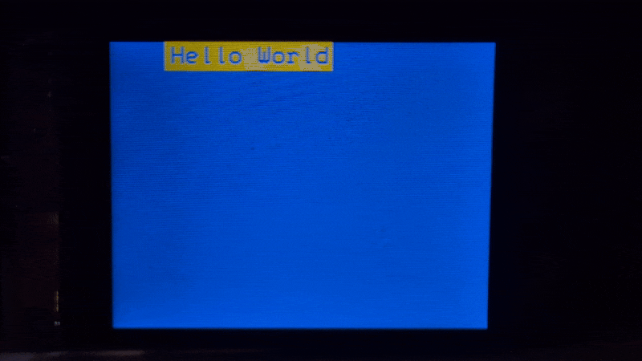
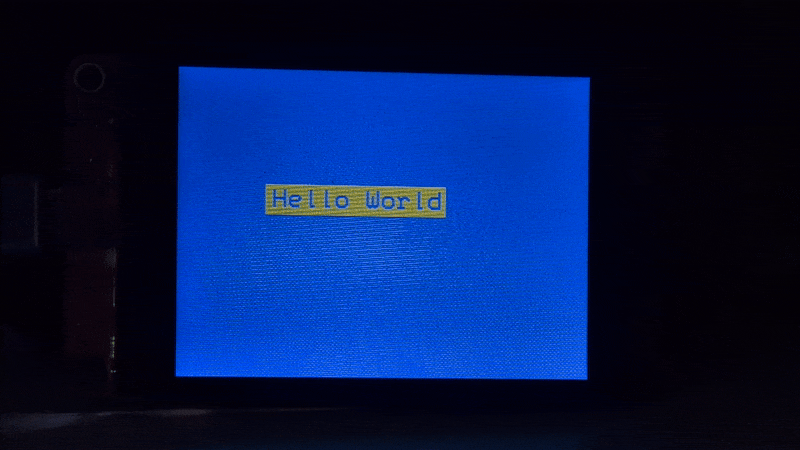

# Hello For Loops

So now you know what for loops are, let's play with them a bit more to see what kinds of things we can do with them.

That wipe erase was pretty cool, let's do it again, but from the other side! To pull this off, all we need to do is change up some of the details of our for loop. Let's start by thinking about what the for loop in the current [hello-world-wipe-blink.ino](../03-hello-loops/hello-world-wipe-blink.ino) file is doing.

It's drawing 140 (the length of the area we need to clear) 1 pixel by 24 pixel rectangles starting from the left edge of the rectangle (the randomly generated <var>`x`</var> value) to the right edge of the rectangle. Our job now is to do the same thing but from the right edge (<var>`x`</var> + 140) to the left edge (<var>`x`</var> + 0). Let's figure out what we need to put in our for loop logic.

```c++
for (int i = ?; i <?> ?; ?)
```

Since we're essentially working backwards from our previous for loop, we can probably just swap some of the values. For example, whereas our previous for loop ends at 140, our current for loop needs to start at 140.

```c++
for (int i = 140; i <?> ?; ?)
```

Again, our previous loop started at 0, this one needs to end at 0; in other words, our for loop should run as long as <var>`i`</var> ≥0.

```c++
for (int i = 140; i >= 0; ?)
```

Finally, instead of counting up from 0, our loop is counting down from 140, so we need to decrement by 1 each loop.

```c++
for (int i = 140; i >= 0; i--)
```

We should be able to drop this in to our previous code.

```c++
for (int i = 140; i >= 0; i--) {
  delay(2);
  lcd.fillRect(x + i, y, 1, 24, TFT_BLUE);
}
```



Neat. 

Let's go just one step further. How about we wipe it from both ends at the same time? You might think that you would need two for loops to achieve this, and you could indeed accomplish this with nested for loops,

```c++
for (int i = 0; i <= 70; i++) {
  for (int j = 140; j > 70; j--) {
    ...
  }
}
```

but there's a simpler way to do this. For loops can initialize and iterate two variables at the same time. We already know the numbers we're working with, so let's plug everything in.

Let's use <var>`i`</var> to draw our skinny rectangles from left to center and <var>`j`</var> to draw them from right to center. That means <var>`i`</var> will start at 0 and <var>`j`</var> will start at 140. We also know that <var>`i`</var> needs to count up, while <var>`j`</var> needs to count down. All that leaves is our condition. As long as our <var>`i`</var> value is no more than than half the length of our rectangle (140 / 2 = 70), the for loop should continue. Let's plug all of that into our new for loop.

```c++
for (int i = 0, j = 140; i <= 70; i++, j--)
```

We also have to draw two skinny rectangles per loop, one on each side of the area we're drawing over.

```c++
lcd.fillRect(x + i, y, 1, 24, TFT_BLUE);
lcd.fillRect(x + j, y, 1, 24, TFT_BLUE);
```



This is fun (at least I think it is). Let's change things up and instead of wiping away our "Hello World," let's have it crawl across the screen from left to right, restarting from a random position each time it crawls off the right edge. At this point, you should give this a try by yourself if you're feeling up to it (even if it takes you a few tries). If you get it to work and your code is different than mine, share it with me and I'll put it at the end of this README so people can see all the different ways there are to do the same thing. If you're not feeling confident enough at this point, no worries!

As always, let's think about what we need to do in a step-by-step manner.

1. We need to draw our box and text.
2. We need to redraw it over and over until it has crawled off the screen.
3. We need to do it all over again.

There are some important details missing here but this is a good place to start. We know we're going to have to use the `fillRect()`, `println()`, and `fillScreen()` methods that we should be fairly familiar with. We know we're going to need a for loop to increment the <var>`x`</var> value of our text. And we know we need to put it inside the `loop()` function to make it repeat. Hopefully you can roughly picture how those elements will be arranged. Let's get into the weeds so we can start putting everything together.

1. We need to draw our box and text.

Since we already know what we're going to draw and how to draw it, the next most important thing is where we're going to draw it. We know we want the text to appear from a random place on the side of the screen, so that means we'll need the `random()` function. The size of the CYD display is 240 pixels but do we want to use the full visible vertical range of the display? When I use randomly generated numbers I like to imagine what would happen with the two most extreme values. 

* If <var>`y`</var> = 0, then the top-left corner of the box will be flush with the top of the screen as it crawls from left to right.
* If <var>`y`</var> = 240, then the top-left corner of the box will be flush with the bottom of the screen, and noting will render since it's all below the bottom of the screen.

Clearly a <var>`y`</var> value of 240 is unacceptable. We want all of our text to be visible as it crawls across the screen. That means we need to offset our maximum <var>`y`</var> value by the pixel height of our box, 24 pixels.

```c++
int y = random(?);
```

<details>
<summary>What's the answer?</summary>

---
216

Because our minimum value is 0, we only need to pass one argument to `random()`. Our maximum value is 216, which is 24 (the height in pixels of our box) less than 240 (the maximum displayable y value on the CYD).

---
</details>

For our crawling "Hello World," we don't need a random <var>`x`</var> value because the path of our box along the x axis is going to be the same for every loop. We want our crawl to be from left to right and the left-most pixel is 0, right? 

No. 

-1 is to the left of 0 on the Cartesian plane. Our box needs to crawl in from off screen, so our initial <var>`x`</var> value needs to be a negative number. Which negative number? Remember, our box is 140 pixels wide.

```c++
lcd.fillRect(?, y, 140, 24, TFT_BLUE);
```

That takes care of drawing our first box. What's next?

2. We need to redraw it over and over until it has crawled off the screen.

If we need to do something multiple times, it's a good bet that there's going to be a loop involved, and I just checked, and we're in a folder called "04-hello-for-loops" so let's use one of those. The question is, how do we set it up? 

* What value do we want to change with each loop? 
* What should the initial starting value be?
* Under what conditions should the loop run?
* How much do we want our value to change? 