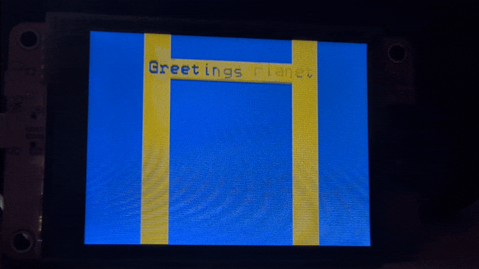

# Hello Functions

Our moving "Hello World" text box is pretty nifty, but if we wanted to change anything, like the text or speed, we'd have to change it in multiple places. Worse, there are a few lines that are exactly the same in each loop. If we wanted to change their behavior, we'd have to change it twice. This we cannot abide. 

## Variables are your friends

Let's start by doing something about our two `delay()` function calls that's been bothering me. If we wanted to change our delay we'd have to do it twice, and that's more chances to make an unforced error than we want to take. 

Start by making a variable inside `loop()`, calling it something descriptive, and giving it a value.

```c++
int delayTime = 1;
```

Next, replace the `1` in your `delay()` functions with `delayTime`.

```c++
delay(delayTime);
```

This is a good best practice to keep your code more maintainable over time.

## Fun with functions

Now, let's take a look at our repetitive code. Each for loop has five lines of nearly identical code; only the final `fillRect()` is different. When you encounter two or more code blocks like this that are doing the same thing, you've found a good opportunity to write a function. Functions are basically just a chunk of reusable code. Sometimes they can spit out a value when they're done and you can use them like a value, sometimes they just perform an action.

The simplest functions in C++ take this form:

```c++
void functionName(int parameter) {
  ...
}
```

The `void` at the beginning indicates what type of value the function will return. A function that doesn't return a value has to be preceded with `void`. If your function returns a value of some sort, you have to tell the compiler what sort of value it is. 

Function names should be named with the same descriptive rigor and brevity as variable names. You *can* call it `doTheThing()` but that isn't very helpful to future you. 

The `int parameter` part inside the parentheses is a value that you're sharing with the function, a value it probably needs to work right. This is analagous to declaring a variable so you need to give it a type.

When I try to refactor repetitive code into a function, I like to start with just the rough outline of a function and add what I need as I go. Another function design principle is to keep the scope of the function as limited as possible. In this case, even though I have four identical lines in each for loop, I'm going to omit `delay()` from my function because it's doing something different than the three lines before it.

```c++
void drawTextBox() {
  lcd.fillRect(90, i, 140, 24, TFT_YELLOW);
  lcd.setCursor(94, i + 4);
  lcd.println("Hello World");
}
```

## Parameters and arguments

This is a good start but you may have noticed that we have an undeclared variable in our function. The <var>`i`</var> value generated by our for loop is local to the `loop()` function and not available to the `drawTextBox()` function. We can make that <var>`i`</var> value available to `drawTextBox()` if we pass it as an argument. Let's give our function a parameter it can use, and remember to give it a descriptive name.

```c++
void drawTextBox(int yPos) {
  ...
}
```

Now we can use our new <var>`yPos`</var> variable in place of <var>`i`</var>.

```c++
void drawTextBox(int yPos) {
  lcd.fillRect(90, yPos, 140, 24, TFT_YELLOW);
  lcd.setCursor(94, yPos + 4);
  lcd.println("Hello World");
}
```

Drop that function in between your `setup()` and `loop()` functions (you can actually put it anywhere you want, as long as it's not inside one of those two functions). Then, replace those three lines in each of your for loops with 

```c++
drawTextBox(i);
```

If you've done everything right, your program should compile and look exactly the same as before. But let's get back to making it look different. Let's tweek our code so that we can input any text we want and have it properly centered.

## Making it adaptable

If you think back to the second tutorial, you'll remember all the number crunching we had to do to get our text centered and draw a box around it. Let's make the CYD do all that work instead.

The first bit of information we need is how long our string of text is. We could count the characters ourself but we want to offload that work to the CYD. To make this work, we're going to take advantage of not the `string` type variable, but Arduino's `String` class.

Inside your `loop()` function, before your for loops, insert the following line:

```c++
String text = "Hello World";
```

Next, we need to make sure our `drawTextBox()` function has access to our new String object. That means we need to add a new parameter to our function declaration.

```c++
void drawTextBox(int yPos, String text)
```

Inside the `drawTextBox()` function, we have to replace `"Hello World"` with the new parameter we just defined.

```c++
lcd.println(text);
```

Finally, inside the for loops in the `loop()` function, we need to pass our new String object into our `drawTextBox()` function. 

```c++
drawTextBox(i, text);
```

Remember, we call this function twice, once in each for loop.

Okay, now that we have our `String` object, how will it help us figure out how long our string is? With the `length()` method. `text.length()` returns the number of characters in our string as an integer value. In our current case, "Hello World" has 11 characters, so that's what `text.length()` will return. Hold on to that knowledge and lets move on to our next problem to solve, the width of the characters in our font.

The BB_SPI_LCD library has a method to return the height of the current active font `fontHeight()`, but not its width. There are some clever ways we could make our own function to do so, but let's keep it simple and just declare a variable to keep track of it for now. Put it in `drawTextBox()` for now (we may move it later).

```c++
int charWidth = 12;
```

With all we've done so far, we can calculate how many pixels our message and box will take up on the screen.

```c++
int textWidth = text.length() * charWidth;
int textHeight = lcd.fontHeight();

int boxWidth = textWidth + 8;
int boxHeight = textHeight + 8;
```

We can already plug some of those values into our `drawTextBox()` function.

```c++
lcd.fillRect(90, yPos, boxWidth, boxHeight, TFT_YELLOW);
```

Next we need to find the x and y center offset which is half of the width and height of our text and box. 

```c++
lcd.fillRect(160 - (boxWidth / 2), yPos, boxWidth, boxHeight, TFT_YELLOW);
lcd.setCursor(160 - (textWidth / 2), yPos + 4);
```

If you want, for the sake of readability, you can create variables for those values.

```c++
int textXoffset = 160 - (textWidth / 2);
int boxXoffset = 160 - (boxWidth / 2);

lcd.fillRect(boxXoffset, yPos, boxWidth, boxHeight, TFT_YELLOW);
lcd.setCursor(textXoffset, yPos + 4);
```

With all of our new code in place, if you compile and upload it, it should run fine. Let's swap out our text and see if it still works.

```c++
String text = "Greetings Planet";
```



Nuts. 

We've got a bug. Based on what's on the screen, can you look at the code and figure out where it all went wrong?

<details>
  <summary>Where it went wrong</summary>

  ---
  The `fillRect()` methods we're using in our for loops to erase our box as it moves are still set to 140 pixels, but our string now takes up 192 pixels, which means there are 26 pixles on each side not getting erased.

  ---
</details>

The trivial way to fix would seem to be to move the `delay()` function and `fillRect()` method still in the for loops into our `drawTextBox()` function, then replace `90` with <var>`boxXoffset`</var> and `140` with <var>`boxWidth`</var>, but that still leaves the issue of whether to erase from the top or bottom, and it seriously violates the principle of Separation of Concerns (our functions should only be doing one thing).

We could calculate all of our variables in the `loop()` function, but then we'd have to pass six arguments into `drawTextBox()` and that seems unwieldy, so we're going to need to [approach this from a different angle](../06-hello-class/README.md).