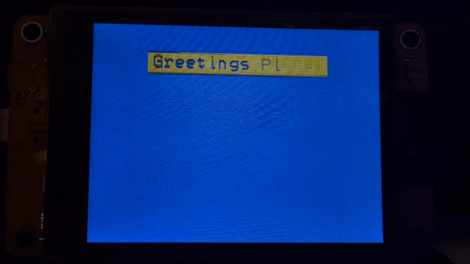

# Hello Class

When last we saw our plucky program, we had run into a conundrum. The plan was to generalize our text box centering and drawing function, but we ran into a situation where we either had to do too much in our function, or pass a burdensome number of arguments to it in order for our program to behave as expected. Thankfully there is a solution. We're going to make a class for our text box.

## Intro to classes

A class is kind of like creating our own type of variable with some extra features bundled in. A more precise way of saying that, is that a class is a way for us to make our own data structures. Here's the basic form a class has to take:

```C++
class ClassName {
  public:
    int someVariable;
};
```

Then, when you want to make use of your fancy new data structure, you create an instance of it, just like you would when declaring a variable.

```C++
ClassName myObject;
```

And that variable on the inside? That's technically called an attribute and you can access it like so:

```C++
myObject.someVariable
```

So far so good? See that `public` bit? That means that everything below `public` is available for use outside of the class (more on that another time). The important thing is that you can not only declare as many variables/attributes as you'd like, you can also create functions/methods. Let's go ahead and make a class for our text box.

## Making the text box class

First, our new class needs a name. I'm going with `TextBox`, but you do you.

> [!NOTE]
> Class names in C++ are traditionally written with the initial letter capitalized.

```C++
class TextBox {
  public:
    ...
};
```

Sweet. Now we need to build in all the variables we want it to have. Part of the reason we're doing this is because our class will be able to carry all of our text box data in a much neater package than otherwise possible (but there will be some other benefits as well). The two most important values are our `String` of text and the `charWidth` because all of our other values are derived from those two.

```C++
class TextBox {
  public:
    String text;
    int charWidth;
};
```

This is enough to get us started and we can start to see some benefit if we drop it into our program (it needs to be in the global scope, so I put it just before `setup()`). 

To use it, we'll need to create an instance of it and define its attributes.

```C++
TextBox textBox;
textBox.text = text;
textBox.charWidth = 12;
```

Now, instead of passing the `String` variable with our text to the `drawTextBox()` function, we can pass the <var>`textBox`</var> object we just created.

```C++
void drawTextBox(int yPos, TextBox textBox) {
  int textWidth = textBox.text.length() * textBox.charWidth;
  int textHeight = lcd.fontHeight();
  ...

}
```

We *could* go ahead and fill our `TextBox` class up with attributes so it can hold all the values we need, but that will clutter up our `loop()` function, and there's a better way to do this: methods.

## Making methods

Because all of our other values are directly derived from <var>`text`</var> and <var>`charWidth`</var>, those are the only ones we have to explicity define. We can use a method to calculate the other ones when we need them.

Methods are defined in pretty much the same way a function is, only we do it inside our class.

```C++
class TextBox {
  public:
    void boxMethod() {
      ...
    }
};
```

Then you can use the method just like we've been using other methods.

```C++
textBox.boxMethod();
```

Let's look back at the program we made in the last tutorial, [greetings-planet.ino](../05-hello-functions/greetings-planet.ino). In particular, look at the last three lines of the `drawTextBox()` function.

```C++
lcd.fillRect(boxXoffset, yPos, boxWidth, boxHeight, TFT_YELLOW);
lcd.setCursor(textXoffset, yPos + 4);
lcd.println(text);
```

Between these three commands — the heart of the function — there are seven variables. Let's take a look at them and figure out which ones we'll have to make methods for in our class.

* <var>`boxXoffset`</var> – derived from <var>`boxWidth`</var> which comes from <var>`textWidth`</var> which comes from <var>`text.length()`</var> and <var>`charWidth`</var>
* <var>`yPos`</var> – passed to the function from the for loop
* <var>`boxWidth`</var> – comes from <var>`textWidth`</var> which comes from <var>`text.length()`</var> and <var>`charWidth`</var>
* <var>`boxHeight`</var> – derived from <var>`textHeight`</var> which comes from <var>`lcd.fontHeight()`</var>
* <var>`TFT_YELLOW`</var> – constant defined in the BB_SPI_LCD library; in the global scope
* <var>`textXoffset`</var> – comes from <var>`textWidth`</var> which comes from <var>`text.length()`</var> and <var>`charWidth`</var>
* <var>`text`</var> – passed into the function as an argument

<var>`yPos`</var>, <var>`TFT_YELLOW`</var>, and <var>`text`</var> are already accounted for. <var>`yPos`</var> and <var>`TFT_YELLOW`</var> aren't part of our <var>`textBox`</var> object and <var>`text`</var> is already part of it, so that leaves the other four for us to make methods for.

Let's start with the first one, <var>`boxXoffset`</var>. We need to figure out three things to make our first method:

1. Will our method return a value, and if so, which type will it return?
2. Does our method require a parameter — outside information — to do its job?
3. What does our method need to do in order to do what we want it to?

```C++
class TextBox {
  public:
    ? boxXoffset(?) {
      ???
    }
};
```

1. Yes, our method should return an `int` value.
2. No, (at the moment 😉) this method doesn't need outside data to function.
3. We need to get the offset based on <var>`text.length()`</var> and <var>`charWidth`</var>

Here's what that looks like:

```C++
int boxXoffset() {
  return 160 - (((text.length() * charWidth) + 8) / 2);
}
```
> [!NOTE]
> The <var>`text.length()`</var> and <var>`charWidth`</var> names are already defined in our class, which is why we can use them here in this class method.

This is a good start, lets put our other methods together and see if any other optimizations show up.

Follow the same method we just used to make `boxXofset()` to make `boxWidth()`. We know we want it to return an integer value, we know we don't need any parameters since the value it returns is based on <var>`text.length()`</var> and <var>`charWidth`</var>, and we know the math we need to do because we already did it.

```C++
int boxWidth() {
  return (text.length() * charWidth) + 8;
}
```

Wait a second ... A large chunk of the code in both methods is the same. That's because our original <var>`boxXoffset`</var> variable was based on the value of <var>`boxWidth`</var>. We can replace the code `((text.length() * charWidth) + 8)` in the `boxXoffset()` method with `boxWidth()`:

```C++
int boxXoffset() {
  return 160 - (boxWidth() / 2);
}
```

`boxHeight` is pretty straightforward since it's just 8 + `lcd.fontHeight()`

```C++
int boxHeight() {
  return lcd.fontHeight() + 8;
}
```

Let's cap things off with making `textXoffset()`, which should be pretty close to `boxXoffset()`.

```C++
int textXoffset() {
  return 160 - ((text.length() * charWidth) / 2);
}
```

That should do it for the initial assembly of our new class. It should look something like this:

```C++
class TextBox {
  public:
    String text;
    int charWidth;
    int boxWidth() {
      return (text.length() * charWidth) + 8;
    }
    int boxHeight() {
      return lcd.fontHeight() + 8;
    }
    int textXoffset() {
      return 160 - ((text.length() * charWidth) / 2);
    }
    int boxXoffset() {
      return 160 - (boxWidth() / 2);
    }
};
```

And our `drawTextBox()` function can be drastically simplified: 

```C++
void drawTextBox(int yPos, TextBox textBox) {
  lcd.fillRect(textBox.boxXoffset(), yPos, textBox.boxWidth(), textBox.boxHeight(), TFT_YELLOW);
  lcd.setCursor(textBox.textXoffset(), yPos + 4);
  lcd.println(textBox.text);
}
```

That just leaves the problem of the `fillRect()` methods that weren't erasing correctly.

```C++
lcd.fillRect(90, i, 140, 1, TFT_BLUE);
```

We need to replace those numbers <var>`90`</var> and <var>`140`</var> with values from our new class. Recall that <var>`90`</var> here represents the x value of the top-left corner of the rectangle to be drawn (the center offset), and <var>`140`</var> represents the width of the rectangle.

Plug in the corresponding methods from our class and this should be done.

```C++
lcd.fillRect(textBox.boxXoffset(), i, textBox.boxWidth(), 1, TFT_BLUE);
```

and 

```C++
lcd.fillRect(textBox.boxXoffset(), i + 24, textBox.boxWidth(), 1, TFT_BLUE);
```

If you put [all the parts in the right place](greetings-planet-no-bars.ino), those pesky bars should be gone!



Here are two things for you to try on your own. 

1. Create a [constructor method](https://www.w3schools.com/cpp/cpp_constructors.asp) that has two parameters: one for the text input and one for the character width.
2. Refactor the `textXoffset()` and `boxXoffset()` methods into a single method that accepts one argument.

[This is how I did it](greetings-planet-refactored.ino), but I would love to see how other people do it!

Now's a good time to pivot to something different. Instead of playing with output, [let's dive into input](../07-hello-touch/).