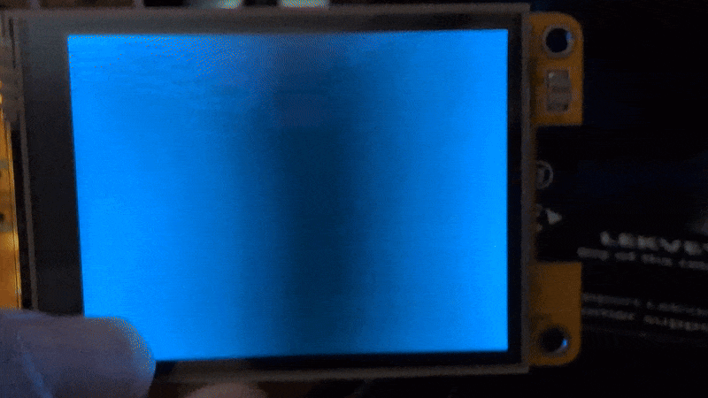

# Hello Touch

Until now we've been producing output to display on our CYD screens. We've done some computing and toyed with some data structures, but we haven't done any input with our touch screens. Let's fix that.

Open up this file, copy/paste it into the IDE, and compile/upload it to your CYD.



## How it works

Neat. Let's do a run down of some of the new stuff we're looking at here.

```C++
#define TOUCH_MISO 39
#define TOUCH_MOSI 32
#define TOUCH_CLK 25
#define TOUCH_CS 33
```

These four lines are essentially creating four named constants with number values. These are the internal pins the resistive touch interface on the CYD uses to communicate with the ESP32 at the heart of the CYD.

* `TOUCH_MISO` is the **M**aster **I**n, **S**lave **O**ut pin for the touch interface. The language is outdated but the gist is pretty clear. In this case the "Master" is the MCU and the "Slave" is the SPI device, our touch display. This is the line over which the ESP32 sends input to the touch interface.

* `TOUCH_MOSI` is the **M**aster **O**ut, **S**lave **I**n pin for the touch interface. This is the channel over which the touch interface sends data back to the ESP32.

* `TOUCH_CLK` is the **CL**oc**K** pin. It synchronizes the timing between the MCU and the touch interface. The data are moving around on the order of milliseconds or microseconds, so in order to parse it all, the MCU and the touch interface need a common time frame.

* `TOUCH_CS` is the **C**hip **S**elect pin. When the CYD wants to talk to the touch interface, it sends a signal to this pin so the touch interface knows to listen. When it's done talking, it drops the signal.

```C++
lcd.rtInit(TOUCH_MOSI, TOUCH_MISO, TOUCH_CLK, TOUCH_CS);
```

This initializes the resistive touch display using the pin values that were previously defined. 

```C++
TOUCHINFO ti;
```

`TOUCHINFO` is a structure (kind of like a class) [defined in the BB_SPI_LCD library](https://github.com/bitbank2/bb_spi_lcd/blob/b243e7421397ba31c6355bad0fd90131ab29508a/src/bb_spi_lcd.h#L89). It has five attributes, but you only have to worry about three of them.

* <var>`x[0]`</var> – the x position of the touch input
* <var>`y[0]`</var> – the y position of the touch input
* <var>`pressure[0]`</var> - the pressure/intensity of the touch input from 0 to 100

<var>`ti`</var> is the name given to this instance of the `TOUCHINFO` structure. It's going to be where our touch input data are stored.

<details>
  <summary><h3>If statement sidequest!</h3></summary>

  ---
  <strong>If</strong> you already know how if statements work, <strong>then</strong> you can skip this bit, but if you haven't seen them before, you may want to take a look.

  If statements are what's known as conditionals in computer science lingo. The easiest form this takes looks like this
  
  * <i>If</i> a certain condition is met
    * do a thing
  
  or, in C++ syntax

  ```C++
  if (condition) {
    do_something();
  }
  ```

  The above `do_something()` function only runs if our condition is true. Things can get more sophisticated with the inclusion of `else`

  * <i>If</i> a certain condition is met
    * do a thing
  * or <i>else</i>
    * do something else

  ```C++
  if (condition) {
    do_something();
  } else {
    do_something_else();
  }
  ```

  In the first if statement, `do_something()` might or might not run. If the <var>`condition`</var> is false, the program will pass over it like a tiny speed bump. In the second one, either `do_something()` or `do_something_else()` is going to run no matter what, but never both. But, we can complicate things still further by adding the `else if`

  * <i>If</i> a certain condition is met
    * do a thing
  * or <i>else, if</i> another condition is met
    * do something else
  
  ```C++
  if (condition) {
    do_something();
  } else if (condition2) {
    do_something_else();
  }
  ```

  In this case, either one or the other of the two conditions might run, depending on the conditions, but never both. You can put an else at the end of the chain if you need to make sure your program does something, but you might not always need to do something. And you can chain together as many `else if`s as you want after your `if`, but you can only have one `else` and it needs to be at the end.

  ```C++
  if (condition) {
    do_something();
  } else if (condition2) {
    do_something_else();
  } else {
    do_another_thing();
  }
  ```

---
</details>

```C++
lcd.rtReadTouch(&ti);
```

This method takes a reading from the touch input and returns a <var>`0`</var> if there's no touch or a <var>`1`</var> if there is one.

And the ampersand? That's some special C++ magic that indicates that the argument being passed is being passed by reference. Normally, when you pass an argument to a function or method, the function makes its own copy of the argument, but when you pass by reference, the function doesn't create a local copy, it gets linked up to the original variable. 

What does that mean? Think back to the class we made for our Hello World text box. When we pass our <var>`textBox`</var> variable (which was an instance of the TextBox class) to our `drawTextBox()` function, `drawTextBox()` gets a copy of <var>`textBox`</var>, not the original. So, if we change one of the attributes of <var>`textBox`</var> from within the `drawTextBox()` function, that change wouldn't be reflected in our original copy in `loop()`. If, however, we pass it as a reference, any change made to <var>`textBox`</var> from within `drawTextBox()` will be reflected in the original back in `loop()`.

So what's going on here? `rtReadTouch()` only returns a <var>`1`</var> or a <var>`0`</var>, not the other positional and pressure data we need to make use of touch input. Instead, it makes changes to the values of <var>`ti`</var> locally, and because it's passed as a reference, those changes are reflected in the original copy in `loop()`.

## Basic state management

Although this program works, there is one glaring flaw in it I want to fix: it has no chill. That is to say, when we're pressing the screen, it prints "Hello World" over and over without end. And if we're not pressing anything, it's constantly runs the `fillScreen()` method. Let's set it up so that we're only printing "Hello World" one time per touch, and likewise only running `fillScreen()` if there's no touch *and* "Hello World" is displayed.

Now that we know what we want to do, we have to figure out how to do it 😅. The simplest way to do this is to create a variable that we can turn "on" or "off" depending on whether our text is on screen. You can call your varaiable whatever you want, but I'm going to make a boolean variable called <var>`onScreen`</var> and set its default value to <var>`false`</var>.

```C++
bool onScreen = false;
```

Now, whenever we print our text to the display, we can change the value of <var>`onScreen`</var> to <var>`true`</var> and after we run `fillScreen()`, we change it back to <var>`false`</var>. Simple, right?

In order to make this magic work, we need to do one more thing: update our if conditions. Let's think about the behavior we want in the terms of an if statement. 

> If the screen is touched (`rtReadTouch()`), print "Hello World" unless it's already onscreen (`onScreen = false`). 

In other words, the first part of our if statement has two conditions that must be met in order to run:

* `rtReadTouch()` must return <var>`true`</var> or <var>`1`</var>
* <var>`onScreen`</var> must be false

Let's put those into our if statement.

<details>
  <summary>Logical operators sidequest!</summary>

  ---
  
  To understand logical operators we have to start with the concept of yes or no, true, or false, on or off, and 1 and 0. It's common in programming to have to distinguish between two diametric values like this and make an action based on whether it's one or the other. This branch in logic is called a conditional, and so far, we've looked at conditionals in for loops

  ```C++
  for (int i = 0; condition; i++)
  ```

  where the conditional establishes under what conditions the for loop will continue, and in if statements

  ```C++
  if (condition)
  ```

  where the conditional establishes under what conditions a special block of code will execute. 
  
  Logical operators set conditions to resolve truth or falsehood when more than one conditional is present

  | AND   | True  | False |
  |-------|-------|-------|
  | True  | True  | False |
  | False | False | False |

</details>