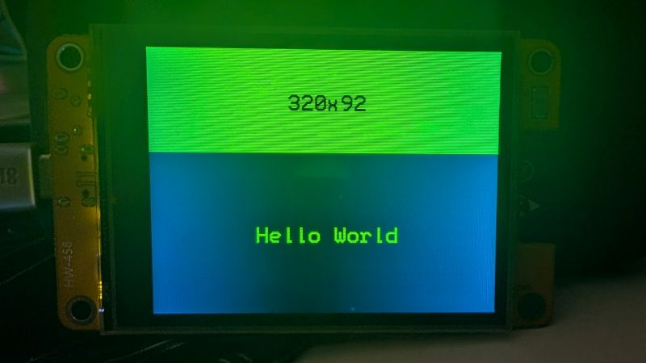

# Hello Buttons

Buttons are an integral part of just about every user interface, so if you want to build something interactive with your CYD, you're going to have to figure them out. Before I picked up the CYD, I liked to play with JavaScript (still do, actually), and whenever I would make a web app one of the first things I would do after figuring out what to make was decide what it's going to look like. I like to use paper.


## Setting up the program

So, from just this rough image, you can see that we're going to need to draw two rectangles `fillRect()` and draw three text blocks `println()`. You can also get a gist of the basic logic we're going for:

* Tap the "Show" button to put the "Hello World" text on screen.
* Tap the "Hide" button to wipe the text.

Let's start by just getting the UI up on the screen, then we'll build the logic around that. Start with a fresh program (let's not directly modify any previous programs) and put in all the parts we need.

We're still using the BB_SPI_LCD library so we'll need to include the library and instantiate the class in the global scope before our `setup()` function.

```C++
#include <bb_spi_lcd.h>

BB_SPI_LCD lcd;
```

We already know we need touch at some point so we can drop in the constants for our touch interface pins.

```C++
#define TOUCH_MISO 39
#define TOUCH_MOSI 32
#define TOUCH_CLK 25
#define TOUCH_CS 33
```

That should take care of our global scope for now. Let's move on to `setup()`. Initialize the display and the touch interface.

```C++
lcd.begin(DISPLAY_CYD);
lcd.rtInit(TOUCH_MOSI, TOUCH_MISO, TOUCH_CLK, TOUCH_CS);
```

Now we get to start making some personal choices such as the color of the UI background, buttons, and text. I'm going to keep things simple and set my background to black, but I'm going to hold off on setting my text color or font size since I might not want my button text to be the same size or color as my "Hello World" text. 

```C++
lcd.fillScreen(TFT_BLACK);
```

Now, I know I said we were going to draw some boxes/buttons, but we have to decide where we're going to do it. More precisely, we have to decide if we're going to draw them one time in the `setup()` function, or if during the course of our program they are going to change at all, in which case it might be better to build them into `loop()`. For now, let's keep things simple and draw them in `setup()`, and if we need to move them later, we can.

## Making the buttons

Making a UI is one of my favorite parts of making a program, it's also possible to get really lost in the weeds and waste hours worrying over every little thing. There's a time and place for that, but it's not here. I suggest doing some quick iteration over a couple of design ideas until you find something you like. 

I'm pretty sure filling up half the screen with buttons is a bad idea. Here's a quick mock up of what that would look like.


Meh. It works. I want to try one more thing first ...


The golden ratio. It's not perfect, but it's better. Now to make some propper buttons.



Let's give them a gap of 4 pixels on each side (which means an 8-pixel gap in the middle) and make them green and red. Figure out the dimensions however you like, but I do it by first cutting it in the middle, ie, one 320×92 rectangle becomes two 160×92 rectangles.


Then I take 4 pixels off of each side, making the dimensions 152×84 and offsetting the top-left corner 4 pixels down and 4 pixels to the right.


Very nice.

I'm going to swap out the text to what I want it to be, which means I'll have to adjust the x value of my `setCursor()` call to keep the text centered. 


Now that we have the basics of the UI figured out, let's move on to the logic! You can use this information to start building out the `loop()` function. Don't be ashamed to [look back at the code we've done previously](../07-hello-touch/hello-touch-on-screen.ino) and reuse what you can so you don't have to reinvent the wheel every program.

## Making the logic

Because of how the BB_SPI_LCD library works, we need to make a TOUCHINFO object. That <var>`ti`</var> is going to hold the x and y values for our touch coordinates.

```C++
TOUCHINFO ti;
```

We need to make an if statement to change the program flow if a touch is detected.

```C++
if (lcd.rtReadTouch(&ti)) {
  ...
}
```

So, if there is a touch, what do we do?

* *If* the touch is on the green button *and* our text isn't shown, then we need to display it.
* On the other hand, *if* the touch is on the red button *and* the text is visible, then we need to clear it.

It looks like we need a variable to keep track of whether our text is displayed, and another if statement. Let's build those up based on what we know. 

```C++
bool onScreen = false;
```

Next, we have to nail down how to know when a touch occurs within one of our buttons. This isn't too hard, we just need to know the lower and upper bounds of the x and y coordinates of our buttons.

We know that each button takes up 152×84 pixels and we know the position of the top-left corner of the button, we can just use some simple arithmetic to figure out the bounds of our buttons.

* "Show" Button – 4,4 to 156,88
* "Hide" Button – 164,4 to 316,88

We'll talk through the first one and I'll leave the second one for you to figure out. 

*If* the touch x value is between 4 *and* 156, *and* the touch y value is between 4 *and* 88 *and* <var>`onScreen`</var> is false, then we draw our text. We're going to need some `&&` operators as well as some comparison operators.

<details>
  <summary><h3>Comparison operators sidequest!</h3></summary>

  coming soon ...
</details>

There are five boolean (true/false) statements we need to evaluate and all of them need to be true for our initial if block to run.

* `ti.x[0] >= 4`
* `ti.x[0] <= 156`
* `ti.y[0] >= 4`
* `ti.y[0] <= 88`
* `!onScreen`

Here's how I would put all that in an if statement

```C++
if ((ti.x[0] >= 4 && ti.x[0] <= 156) && (ti.y[0] >= 4 && ti.y[0] <= 88) && !onScreen) {
  ...
}
```

Two things. I didn't need to put the extra parentheses in there, but I did anyway because it helps me to see what all the parts are doing. And, this is ugly and hard to parse and it's going to be the first thing we clean up once we get this program up and running.

One more thing, it's your turn to figure out the next part.

```C++
if ((ti.x[0] >= 4 && ti.x[0] <= 156) && (ti.y[0] >= 4 && ti.y[0] <= 88) && !onScreen) {
  ...
} else if (???) {
  ...
}
```

<details>
  <summary>Show next part ...</summary>
  
  ```C++
  else if ((ti.x[0] >= 164 && ti.x[0] <= 316) && (ti.y[0] >= 4 && ti.y[0] <= 88) && onScreen) {
    ...
  }
  ```
</details>

Now that our if statements are straightened, let's put the last bits of logic in. First up, drawing our text to the display. You've done this before so I'm not going to hold your hand on this one. If you need a bit of guidance, take a look at some of the previous programs we've done where we've put text on screen.

Likewise, put in the logic to draw over/erase our text. Keep in mind that you don't want to use `fillScreen()` since that will draw over our buttons as well. You just want to draw a rectangle large enough to overwrite the text. 

Hopefully what you put together looks something like this:


Hopefully you were more cognizant than me and remembered to change the <var>`onScreen`</var> variable every time the button was pushed ...

## Cleaning up

It's time to clean up those gnarly if statements. They work but they're ugly. 