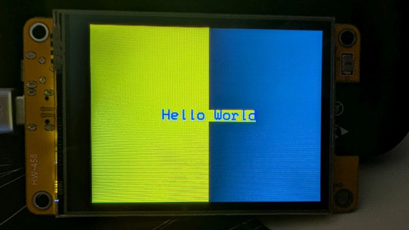
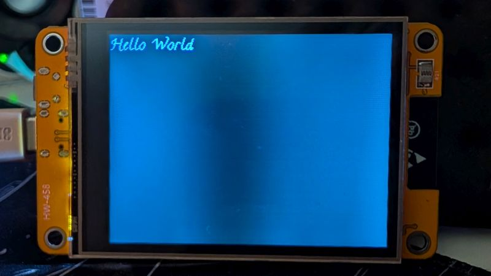
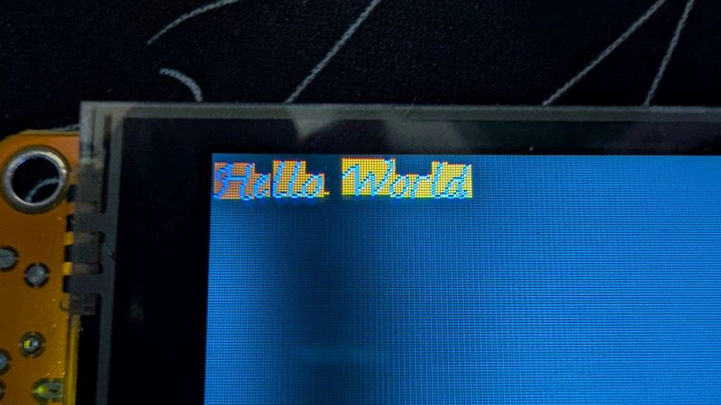
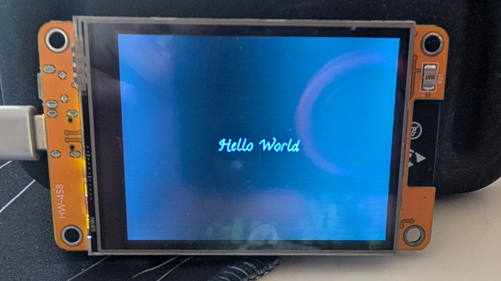
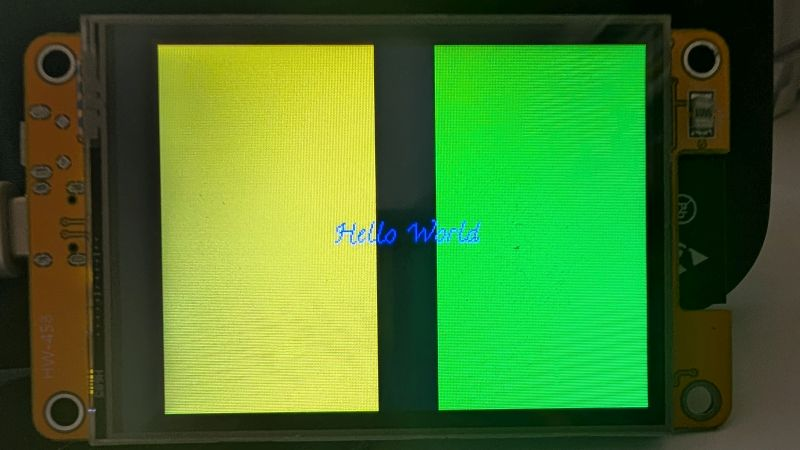

# Hello Fonts (and Typefaces)

So in case you missed the conceit of these tutorials on the README for this repo, I'm learning this as I go and bringing you along for the ride. I miss some things and I'm constantly learning and poking and prodding to see how things work. All that to say, I found a simpler way of figuring out how many pixels a string of text takes up on screen, but first, let's get into fonts and typefaces.

<details>
  <summary>Fonts vs typefaces sidequest!</summary>

  ---

  *Technically*, typefaces are the sets of glyphs with unique designs like Arial or Times New Roman. Fonts are variations on those designs, like size or italics. So, all the fonts we've been using so far in this tutorial are part of the same typeface. Pretty simple distinction, but most people call both font.

  ---

</details>

Let's take a big step back to the [program we made in the second tutorial](../02-better-hello-world/hello-world-2.ino). If you don't want to click the link, it's the one where we centered "Hello World" and put it in a box. Recall that for the `setTextColor()` method we had to specify a color for the text and an optional color for the background that would default to black. This lack of transparency works fine for relatively simple UIs and layouts, but has some obvious drawbacks.



This drawback is only limited to the default fonts included with this library, but there are alternatives, you just have to find them, download them, and put them in the right place so your program can find them.

## Installing and using fonts

To start, download a font (here, [take this one](Calligraffitti_Regular_16.h)), and put it in your `libraries` directory with your other downloaded libraries. On Windows, it's probably in C:/Users/[your_name]/Documents/Arduino. In the `libraries` directory, create a new directory with the same name as the typeface font (minus the ".h") and place your new font in there. Now that we're prepared, let's take a look at a new hello-world program with our font.

```C++
#include <bb_spi_lcd.h>
#include "Calligraffitti_Regular_16.h"

BB_SPI_LCD lcd;

void setup() {
  lcd.begin(DISPLAY_CYD); 
  lcd.fillScreen(TFT_BLACK);
  lcd.setFreeFont(&Calligraffitti_Regular_16);
  lcd.setTextColor(TFT_BLUE);
  lcd.setCursor(0, 16);
  lcd.println("Hello World");
}

void loop() {

}
```



Let's break down what this new code is doing. We still need our `#include` statement with the BB_SPI_LCD library, but now we're going to add another one just beneath it that's slightly different.

```C++
#include "Calligraffitti_Regular_16.h"
```
> [!NOTE]
> The distinction between the double quotes and the angle brackets is well beyond the scope of this tutorial but it mostly has to do with where to look for the file being included. In this case, you should be able to swap in angle brackets and be just fine.

The next new bit of code is

```C++
lcd.setFreeFont(&Calligraffitti_Regular_16);
```

`setFreeFont()` is essentially the same as `setFont()` from our perspective, the biggest difference is we have to pass in the font variable as a reference, so don't forget the ampersand if you're doing this with a different font.

```C++
lcd.setTextColor(TFT_BLUE);
lcd.setCursor(0, 16);
```

The first thing to notice that's different here is we're only passing one color value to the `setTextColor()` method. That's because the typeface format that this library uses is designed to have a transparent background. The implementation used in BB_SPI_LCD can add those colors in, but it looks kind of janky and there's not really a good use case for it.



The other thing to notice is that we set our cursor to be 16 pixels down from the top-left corner. That's also due to the typeface format which renders from the bottom-left corner instead of the top-left. The type of external typeface supported by BB_SPI_LCD and many other libraries is GFX, a format that has been optimized to run on microcontrollers like the CYD. Most GFX fonts will list their height in the file name making it easy to figure out this offset. 

> [!NOTE]
> Unlike the typefaces you use on your computer, which are vector-based, GFX fonts are bitmaps, literal arrays of data indicating which pixels to render when drawing the glyphs on the screen. Check out this page to get a [deep dive on how they work](https://www.sigmdel.ca/michel/program/misc/gfxfont_8bit_en.html).

## A new method has appeared!

This transparent background is pretty cool, but one thing you'll notice with this typeface is that it's not monospaced, that is to say, each glyph is a different width which means we'll need a new tool if we want to center our text: `getTextBounds()`. This method will find the hypothetical bounds of a string of text if it were to be displayed on the screen. To use this method of the BB_SPI_LCD class, you need to pass it seven arguments. 

* An array of characters. This is different from the `String` class we used previously
* The x and y values of where the text would begin being rendered
* References to two signed 16-bit integers (`int16_t`) representing the x and y coordinates of the top-left corner of the rectangle that would cover all of the text if it were rendered
* References to two unsigned 16-bit integers (`uint16_t`) representing the width and height of the rectangle that would cover all of the text if it were rendered

Let's start with our array of characters. Before the `String` class, there was `char`, a variable type that was just a single character, usually just one of the 256 ASCII characters. To make a string without `String` you have to make an array of characters.

```C++
char our_string[] = "Our String";
```

This, or an explicit string, is the data type that `getTextBounds()` is expecting. One caveat when using an array of `char`s: You cannot resize the array; if you create it to be only 10 characters long, you cannot make it 12 after the fact.

Now let's talk about these odd integer types. A normal integer (`int`) is usually 16 bits but can be 32 bits as well, it depends on a couple of factors that aren't important for this discussion. Using `int16_t` is just a way of explicitly limiting the size to 16 bits (-32,768 to 32,767). Similarly, `uint16_t` makes an unsigned (no negative numbers) 16-bit integer (0 to 65,535). Also take note that these variables are passed via reference, so their value will change after the method runs, even though the method itself won't return any values. Here's what it looks like to use it.

```C++
int16_t x1, y1;
uint16_t w, h;

lcd.getTextBounds("Hello World", 0, 0, &x1, &y1, &w, &h);
```

After the function runs, the <var>`x1`</var> and <var>`y`</var> values will be the top-left corner of the text were it to render. In the case of the typeface we used, those coordinates would be 0, -16. The <var>`w`</var> and <var>`h`</var> will also have changed to whatever the width and height of the string would be were it to be rendered. This method works whether we use BB_SPI_LCD's included fonts or a GFX typeface.

## Making a new text-centering function

Now that we know how to use this method, let's make a function that displays our string in the center of the display. But, before we do that, let's take a look at two more methods BB_SPI_LCD has that can help us down the line, `height()` and `width()`. These handy methods return the height and width of the current display. By subbing these in for raw numbers, our code will be more reusable. 

We're going to start with the [program used at the begining of this tutorial](hello-fonts.ino). We can go about this in a few ways. We *could* do it the way we did it before, with a function that takes our text input and then draws the text centered on the display, *or* we could learn something new! 

So instead of writing a function that takes text and displays it to the screen, let's write a function that takes a text argument and gives us back the x and y coordinates we need to print our text centered. Notice I didn't say returns those values. We're going to write a function that passes them by reference.

First, we need a function and it needs a name.

```C++
void getOffset() {
  ...
}
```

Next, let's do the parameter. We know it needs to accept an array of characters, it also needs the variables that will hold the x and y position of the cursor, so let's put those in as well.

```C++
void getOffset(char *text, int *x, int *y) {
  ...
}
```

Okay, what's up with those asterisks? Those are called dereference operators and there's two things going on here. First, let's talk about <var>`*text`</var>. Because `getTextBounds()` is expecting an array of characters, that's what we have to pass to our `getOffset()` function. But, when you pass an array as an argument in C++, the function/method doesn't get the array and all its data, what it gets is a pointer to the memory address of the first element. The dereference operator tells C++ that, no, actually we want the data at that address, not the address itself.

The dereference operators in front of <var>`x`</var> and <var>`y`</var> are doing the same thing. The plan with this function is to pass in those two values by reference, which is a simplified way of saying that we're going to share the memory addresses of those variables rather than their data. Because we've passed in the addresses of our variables, if we want to use their data, we need to use the dereference operator to access them.

As always, I encourage you to try this on your own before following along with me. Still here? Drop that function in the global scope and let's start putting some logic in it.

Recall that we need to do three things to find where to place the cursor for our text to be drawn centered.

1. We need to find the center coordinates of the screen.
2. We need to find the dimensions of our rendered text. 
3. We need to offset half the width and height of that text from the center of the display.
   * Keep in mind that our fancy typeface draws from the bottom-left corner of the cursor.

To accomplish our first task we just need to find half the value of whatever `height()` and `width()` return.

```C++
int scrMidX = lcd.width() / 2;
int scrMidY = lcd.height() / 2;
```

To do our second task we need the `getTextBounds()` method that started this whole thing. Remember that this method doesn't return any values, but it expects some of its arguments to be passed by reference, which means we need to make some variables of specific types.

```C++
int16_t x1, y1;
uint16_t w, h;
lcd.getTextBounds(&text, 0, 0, &x1, &y1, &w, &h);
```

The width and height information is all we want out of this method, and with it, we can use arithmetic to find out where to put the cursor. The x position is pretty straight forward. We take half of the width of our text (`w / 2`), and offset that from the midpoint of the display <var>`scrMidX`</var>.

```C++
*x = scrMidX - (w / 2);
```

The y position is a bit different due to GFX typefaces being drawn from the bottom-left corner, but that just means our offset is in a different direction.

```C++
*y = scrMidY + (h / 2);
```

We need the asterisks there because we're going to pass the address of our variables as arguments, and the dereference operator lets us manipulate the values at those addresses.

That should handle the function logic, now we need to call our function from the `setup()` function, but first we need to do a little setup. For starters we need the variables we're going to pass the addresses of.

```C++
int x, y;
```

We also need a variable for our string.

```C++
char text[] = "Hello World";
```

Now, when we call our new `getOffset()` function, we need to pass our text string, and **references** to our two variables. We don't need to put an address-of operator (&) in front of <var>`text`</var> because it's an array and C++ automatically passes its memory address to the function when it's passed as an argument (rather than the values in the array).

```C++
getOffset(text, &x, &y);
```

If you've put everything in the right place, you text should show up in the center of the display.



And just to show you that the typeface is transparent



This function to get the center offset for printed text is pretty cool, but there's one glaring problem with it: It will only give the correct values for GFX fonts, not the BB_SPI_LCD fonts. See if you can figure out what needs to be done to make this function work for both typefaces. [Take a look at the code](https://github.com/bitbank2/bb_spi_lcd/blob/b243e7421397ba31c6355bad0fd90131ab29508a/src/bb_spi_lcd.cpp#L8473) for the `getTextBounds()` method in the BB_SPI_LCD library to get a hint. Here's how I did it.