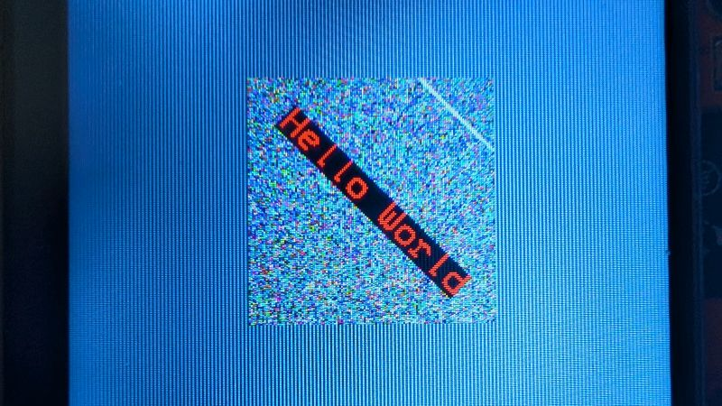

# Hello Sprites

Okay, we're not going to make a video game (although you probably could if you wanted to), instead, we're going to use sprites to improve some of our previous programs. For our purposes, a sprite is a predrawn image that can be placed anywhere on the screen as needed. 

When we've made our programs up until now, we've created a single instance of the BB_SPI_LCD class. When we run the `begin()` method of that class, we're essentially hooking up that instance to the display so we can use it to draw letters and rectangles. But we can make multiple instances of this class to draw on invisible, virtual displays. Then, when we're ready to actually display what we've drawn on our virtual displays, we can run the `drawSprite()` method from our primary instance to display it. I know that sounds confusing, so let's look at [an example](hello-sprites.ino) so you can see what's happening.

## `drawSprite()`

```C++
#include <bb_spi_lcd.h>

BB_SPI_LCD lcd, virt;

void setup() {
  lcd.begin(DISPLAY_CYD);

  virt.createVirtual(132, 16);
  virt.setTextColor(TFT_RED);
  virt.setFont(FONT_12x16);
  virt.print("Hello World");

  lcd.drawSprite(0, 0, &virt);
}

void loop() {

}
```

Okay, let's look at what's new and see what it's doing. The first thing to take note of is the <var>`virt`</var> object. The name isn't too important, this is just going to be our virtual canvas where we can hold our sprite until we need it.

```C++
virt.createVirtual(132, 16);
```

This creates the virtual canvas that's 132 pixels wide and 16 pixels tall (just big enough to contain "Hello World" in the 12 × 16 font). Think of it like `begin()`, only instead of plugging into the physical display, we're making a virtual one. Keep in mind, there are limits to the size of your virtual canvas on the CYD (55,269 pixels, or 267 × 207 pixels, at least in my tests, but that probably varies depending on how big your program is). You *can* make a virtual display larger than this, but if you do, it won't show up when you try to draw it. For reference, that means you can make a virtual display the length of the physical display, but only 172 pixels tall (340 × 172), a virtual display the height of the physical display but only 230 pixels long (240 × 230), or a 235 × 235 square.

```C++
lcd.drawSprite(0, 0, &virt);
```

The last method draws our sprite and the given coordinates, and passes the memory address of our <var>`virt`</var> BB_SPI_LCD object.

Why go to all this extra work? Because it's faster. We're working at a very low level here, so when we're drawing a letter or a rectangle, the BB_SPI_LCD library is calculating which pixels to draw and where to draw them. When we have more of the information in memory, we can cut out some of the computation and just transfer the data that have already been virtually drawn onto the display. For lots of applications, this kind of performance boost doesn't really matter, but if we're trying to animate something, it becomes important. To get an idea, [let's revisit our moving textbox](../05-hello-functions/hello-world-up-down-function.ino) from a few tutorials ago.


We're going to update this sketch so that our textbox is a sprite stored in memory instead of being re-rendered every frame. To start, make another instance of BB_SPI_LCD and give it a name.

```C++
BB_SPI_LCD lcd, sprite;
```

Now, inside of `setup()`, we need to render our sprite on the virtual display. Thankfully, we have all of the data we need in the previous program. Make a virtual display the same size as the box/rectangle over which our text will be drawn. 

```C++
sprite.createVirtual(140, 24);
```

Now, we have to build our sprite just as we would if it were being drawn on the display. First, the rectangle.

```C++
sprite.fillRect(0, 0, 140, 24, TFT_YELLOW);
```

Next, the text. Don't forget, we have to set the font, color, and cursor location just as we normally would.

```C++
sprite.setFont(FONT_12x16);
sprite.setTextColor(TFT_BLUE, TFT_YELLOW);
sprite.setCursor(4, 4);
sprite.print("Hello World");
```

Add these five lines to the `setup()` function. You can leave in everything that's there, but see if you can figure out which lines we won't need anymore and remove them.

Finally, we can completely replace the contents of of `drawTextBox()` with one call to the `drawSprite()` method.

```C++
lcd.drawSprite(90, yPos, &sprite);
```

At first glance this may seem like doing more work to achieve the same outcome, but set the `delay()` of each sketch to <var>`0`</var> and look at them side by side. First, the version without the sprite:


And now, the version drawn with the sprite:


The sprite has fewer artifacts and moves faster because the CYD doesn't have to compute what to draw, it just slaps it on the display from memory. Pretty cool. There's actually an even faster way to render sprites on the screen: `pushImage()`. 

## `pushImage()`

```C++
#include <bb_spi_lcd.h>

BB_SPI_LCD lcd, virt;

uint16_t buffer[132 * 16];

void setup() {
  lcd.begin(DISPLAY_CYD);

  virt.createVirtual(132, 16, buffer);
  virt.setTextColor(TFT_RED);
  virt.setFont(FONT_12x16);
  virt.print("Hello World");

  lcd.pushImage(0, 0, 132, 16, buffer);
}

void loop() {

}
```

So what's different here? First of all we have that unsigned 16-bit integer array called <var>`buffer`</var> up there. That's going to hold the data for our sprite. Then, instead of `drawSprite()` we call `pushImage()`, which needs to know where to draw, how much space the image is going to occupy, and our array with the sprite data.

If you drop that method into the upgraded moving textbox program, you'll see it moves even faster than the one using `drawSprite()`.


You're probably asking yourself, "If `pushImage()` is so good, why even use `drawSprite()`?" Put simply, `drawSprite()` can do more. `pushImage()` is more "primitive" and "closer to the silicon," which is how it gets its speed, but `drawSprite()` can do fancy stuff like scaling and clipping that `pushImage()` can't do.

## Sprite clipping

Let's look at clipping. Run that [previous sketch](hello-sprites-push.ino) again, but change the x value for where to push the image.

```C++
lcd.pushImage(240, 0, 132, 16, buffer);
```


It looks kind of like Aurebesh. `pushImage()` is just reading pixel data from our buffer array and putting it into the box in which it was told to put it (Of course if you set your x or y value to a negative number, the box won't even be rendered). You'll get similar (although more legible) glitches if you make the box in which to draw it too wide or too narrow.

```C++
lcd.pushImage(0, 0, 133, 16, buffer);
```


```C++
lcd.pushImage(0, 0, 131, 16, buffer);
```


Now let's go back to rendering with `drawSprite()` and position our sprite so it clips the left edge.

```C++
lcd.drawSprite(240, 0, &virt);
```


We can also draw a sprite with a negative offset.

```C++
lcd.drawSprite(-60, 0, &virt);
```


See if you can take this new tool and make a program where the textbox sprite slides across the screen, appearing from a random position offscreen and moving left to right until it's offscreen again, only to reappear from another random height. [Here's how I did it](hello-sprites-left-to-right.ino).

## Sprite rotation

There are a few caveats when it comes to rotating sprites and the process of doing it was not intuitive to me, so I'm going to try to break it down for you. The first thing to understand is that you will need a minimum of three instances of BB_SPI_LCD to rotate one sprite, here's what the method looks like:

```C++
source_sprite.rotateSprite(&destination_sprite, xCenter, yCenter, angle_of_roatation);
```

Once you've done this black magic, you can draw the `source_sprite` as we've been doing in the previous examples. 

```C++
lcd.drawSprite(0, 0, &destination_sprite);
```

But to get a better grip on it, let's look at a [flawed example](hello-sprites-rotate-flawed-01.ino).

```C++
// hello-sprites-rotate-flawed-01.ino
#include <bb_spi_lcd.h>

BB_SPI_LCD lcd, sprite1, sprite2;

void setup() {
  lcd.begin(DISPLAY_CYD);

  sprite1.createVirtual(132, 16);
  sprite1.setTextColor(TFT_RED);
  sprite1.setFont(FONT_12x16);
  sprite1.print("Hello World");

  sprite2.createVirtual(132, 16);

  sprite1.rotateSprite(&sprite2, 66, 8, 45);

  lcd.drawSprite(0, 0, &sprite2);
}

void loop() {

}
```

This program will compile and run, but you might not get the output you're expecting.


We've got a bit of the "o" in "Hello" and the first "W" in "World," but everything else has been cut off. What's happening? `rotateSprite()` is doing its job of rotating the contents of the <var>`sprite1`</var> virtual canvas/display, but it doesn't rotate the display itself. So, in this case, our "Hello World" sprite has been rotated 45 degrees clockwise, but that rotation has clipped most of the sprite out of the bounds of its virtual display. Tweak the size of the <var>`sprite2`</var> virtual display to look at this from another angle.

```C++
sprite2.createVirtual(132, 132);
```

This bigger destination sprite has enough room to render our twisted sprite, but if you run the program with this update, you'll still get a glitch.


Even though there's enough room to contain our rotated sprite, we get the same result. The problem is our source virtual display doesn't have enough room to contain the spun sprite. To solve our issue we need to make a source display that's big enough to contain our sprite after spinning. Let's make it as tall as the text is wide.

```C++
sprite1.createVirtual(132, 132);
```

Likewise, our destination needs to be at least as large as the source.

```C++
sprite2.createVirtual(132, 132);
```

Position your cursor so that the text is virtually rendered in the center of <var>`sprite1`</var> (I'll let you crunch the numbers on that, it's good practice). Don't forget to adjust your coordinates for the center of rotation, and just so it looks pretty, render <var>`sprite2`</var> in the middle of the screen.



Pretty cool. Of course you can make this look "better" with some strategically applied `fillScreen()` calls, but I'm kind of digging the glitchy aesthetic. You can probably guess what's next: make a perpetually spinning sprite! This one is pretty easy, you just need to move some things into a for loop and you're practically done. You can look at [my implementation](hello-sprites-spinning.ino) if you need some inspiration.

