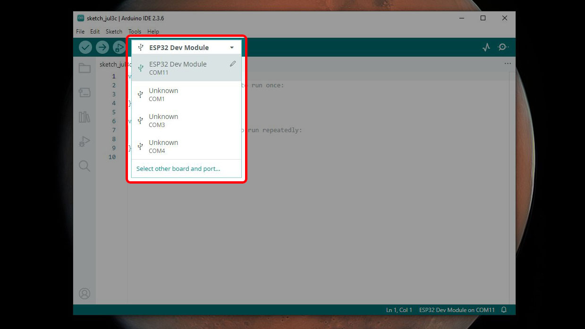
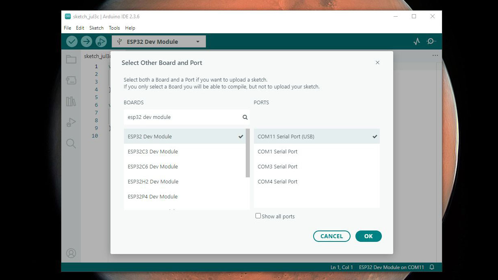
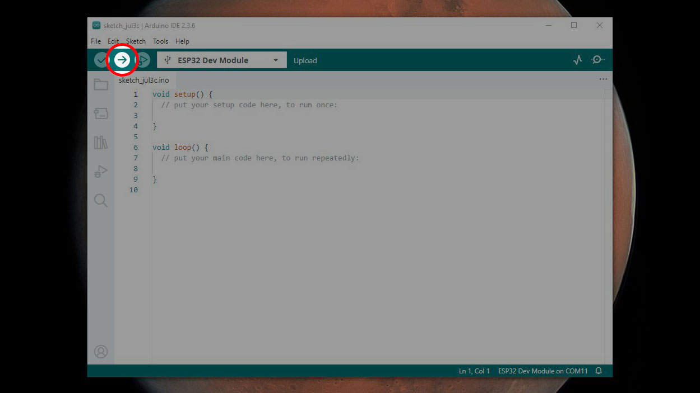
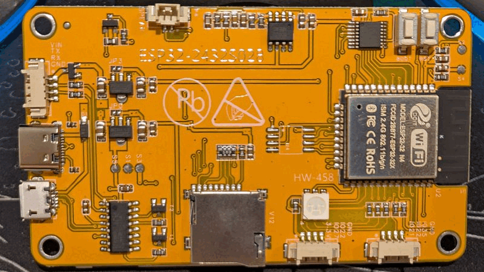

# Loading a program on your CYD with Arduino IDE

If you already know how to load a program to your microcontroller using the Arduino IDE, [jump ahead to the first example](01-hello-world/BB_SPI_LCD/01).

The Arduino IDE is lots of things; one of those things is a text editor that lets you input your programs. It also serves as a bridge between your computer and your CYD, uploading your programs onto your CYD. The process to make it happen is pretty easy.

First, make sure your CYD is connected to your computer via a USB cable.

Next, find the dropdown menu near the top of the Arduino window and select your board and port. 

If the board listed for the port your CYD is on is listed as "Unknown," you'll be taken to the Select Other Board And Port menu when you select it. From this menu, search for and select "esp32 dev module," then choose the port to which your device is connected. Click "OK" once you've selected the correct board and port.

Now you're all set to upload a program to your CYD. Once you have a program in the text editor, click the button with the arrow icon in the top-left corner to compile your program and upload it to your CYD.

One last caveat: in order to upload a program to your CYD, it needs to be in DFU (device firmware upgrade) mode. To do that, while the CYD is plugged in, press and hold the BOOT button, press the RST button, then release the BOOT button. The CYD screen will go black and it will be ready to have a new program uploaded to it.

[Let's go to the first example](01-hello-world/BB_SPI_LED/01/)!