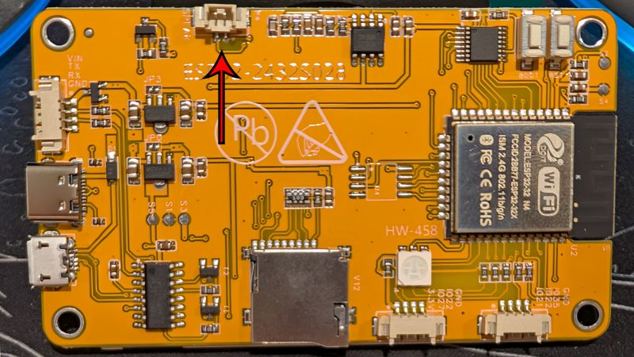

It's about time to make some noise. Sound probably isn't something you need for most projects, but it's a nice tool to have at your disposal. 

Before we get too far, to make noise with your CYD, you're going to need a speaker. I got a [pack of four](https://www.amazon.com/dp/B0177ABRQ6) from Amazon along with a [bundle of 1.25 mm 2-pin JST connectors](https://www.amazon.com/dp/B078NPRW46), then I soldered a pair of them together along with some heat shrink. Once everything's assembled, plug it into the 2-pin speaker connector on the back of your board.



If you've got all that done, let's start with the simplest noise we can make.

```C++
#define SOUND_PIN 26

void setup() {
  tone(SOUND_PIN, 440);
}

void loop() {

}
```

Once you've got that compiled and running, turn it off because it's probably annoying. Now that we're not being yelled at by our silicon, let's talk about what's happening.

```C++
#define SOUND_PIN 26
```

https://github.com/user-attachments/assets/fabc6c34-21de-4f0b-a7dc-f52a5e6f2e26

First off, we're defining which pin is going to receive our sound output. You don't have to put it in a constant like this, but it's a good habit that will make your code more readable in the long run.

```C++
tone(SOUND_PIN, 440);
```

This is the function (which is part of Arduino's bag of goodies) that makes the sound. The sound it makes is a square wave with a duty cycle of 50%. In other words a square wave whose peaks and troughs are of equal duration/width. You can only play one `tone()` at a time, even if you're sending them to multiple pins. The lowest frequency value you can input is 32 Hz and the largest is 8 MHz (the average range of hearing is about 20 Hz to 20 kHz, so there's not many good reasons to crank it up to 8 MHz).

We can also add another argument to the `tone()` function to control its duration in milliseconds.

```C++
tone(SOUND_PIN, 440, 1000);
```
