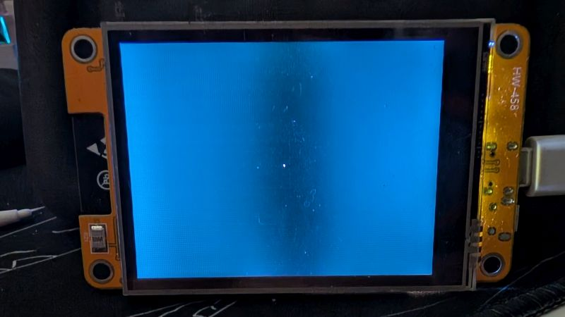
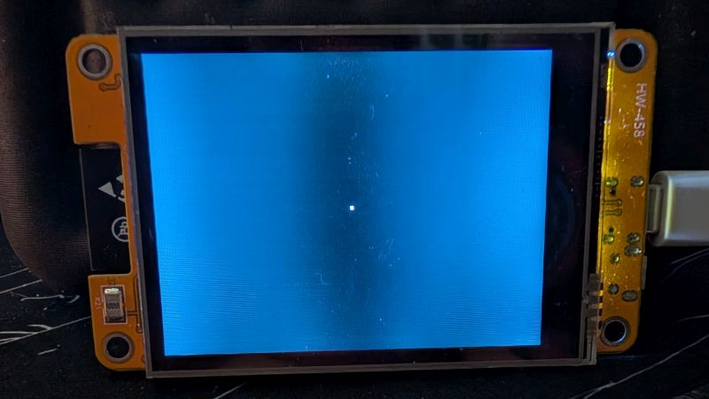
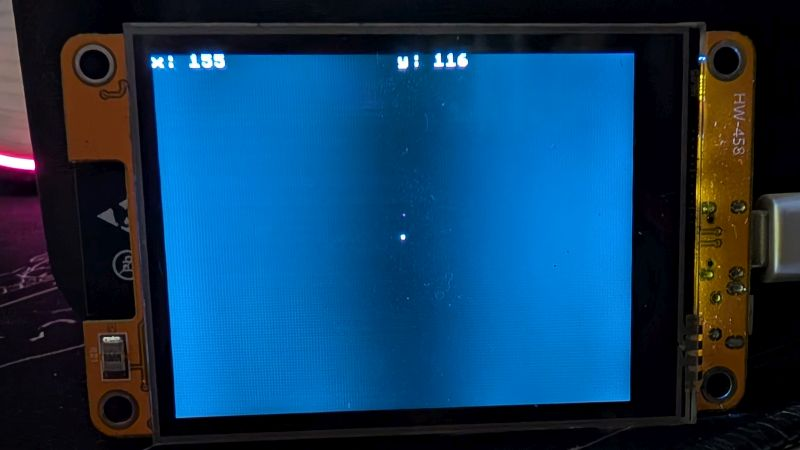
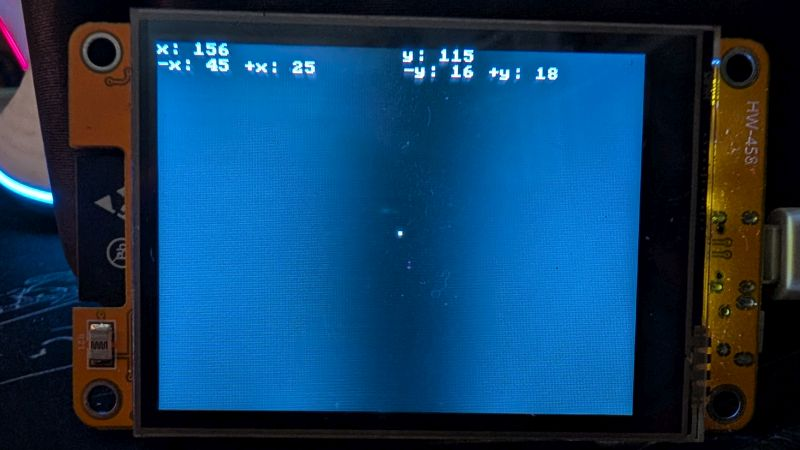
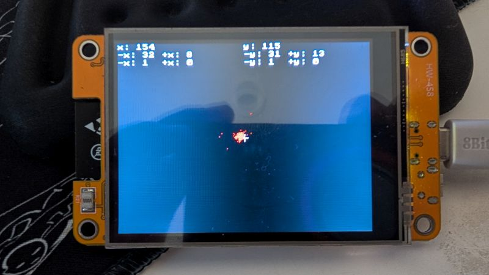
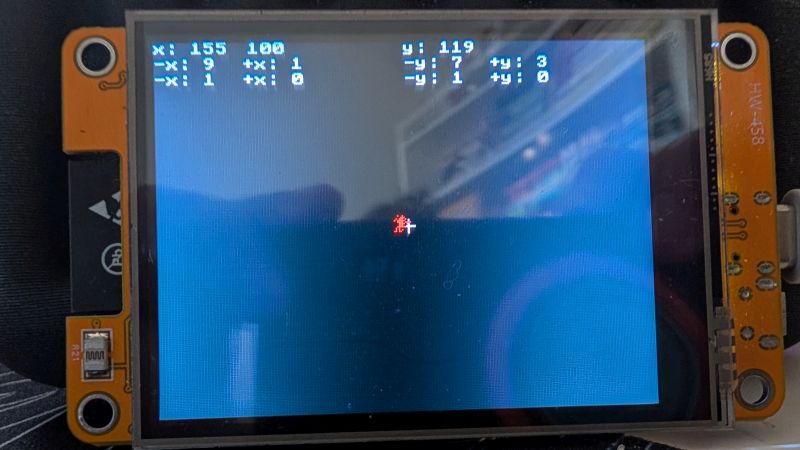
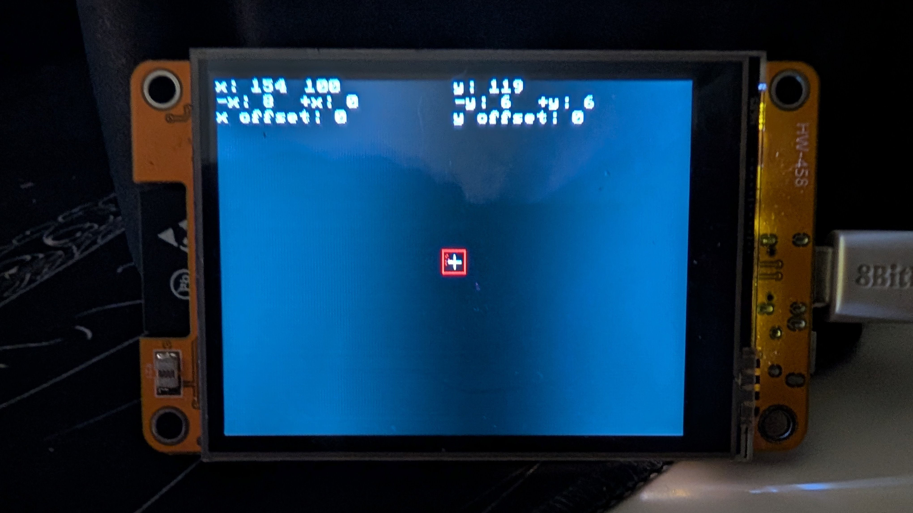

# What I Want to Build

I anticipate having to make an on-screen keyboard for my CYD, so I'm going to make a program to determine about how big my buttons should be so I can get a better idea of how I can configure my virtual keyboard. Here's the idea:

I'm going to put a pixel near the center of the screen, then I'm going to register touches and record the max distance in each direction those touches register and what the average distance is. Plus I'm going to draw boxes representing those two values to roughly represent how big those buttons will be.

Sounds simple! First I'm going to get a pixel on the middle of the screen.

```C++
lcd.drawPixel(160, 120, TFT_WHITE);
```



Okay, that's a little too small. Maybe a small box would be better ...

```C++
lcd.fillRect(159, 119, 2, 2, TFT_WHITE);
```



Awesome, now let's display some touch data. I'm going to make two variables for my x and y data then use `print()` to put them on-screen, I think towards the top is best (for now).

```C++
if (lcd.rtReadTouch(&ti)) {
  x = ti.x[0];
  y = ti.y[0];
  
  lcd.setCursor(0, 0);
  lcd.printf("x: %d", x);
  
  lcd.setCursor(160, 0);
  lcd.printf("y: %d", y);
}
```



It's coming together! Next I'm going to do the max offset values and I think I'm going to do it one line down so I'm going to put my cursor at 10, 0 to start but I'm going to have four values here x left, x right, y up, and y down so I'm going to crunch some numbers to make sure my output looks good =P 

I don't think my max offset from the center will be more than 100 pixels so I'll give myself 6 characters per offset ("-x: ##") and make sure to put my next value right of that. Since I'm using an 8 by 8 font, that means I need to move the cursor more than 40 for each output. I'll probably need some variables to hold those values and logic to determine them as well. Here's a bit of the code:

```C++
if (y < 120) {
  yu = ((120 - y) > yu) ? (120 - y) : yu;
} else {
  yd = ((y - 120) > yd) ? (y - 120) : yd;
}

lcd.setCursor(160, 10);
lcd.printf("-y: %d", yu);

lcd.setCursor(216, 10);
lcd.printf("+y: %d", yd);
```



Now I need to get the averages. To keep a running average you only need two numbers, the average and the number of values in the set that produced the average. Then, to add a new number to your set, you multiply your average by the number of items in your set, add the new number, then divide by the new number of items in your set. It sounds a bit more complicated than it is. The gist of all that is that I'll need eight more variables to keep track of all this and some new logic (I'll probably make a function).

Okay. Looking at what I have so far, I have way too many variables so I'm going to organize them into a struct, that way I have similar values all grouped together and it makes sense to me when I'm looking at my code.

```C++
struct Offset {
  int max = 0;
  int avg = 0;
  int count = 0;
};

Offset xNeg, xPos, yNeg, yPos;
```

And this will be a good place to put a method to update my average. But, before I do that, I'm going to test that my previous code still works with this new code. It works! Here's my average updating method:

```C++
void newAvg(int num) {
  avg = ((avg * count) + num) / (++count)
}
```

There's something wrong with my output. I've put in a `drawPixel()` call to show where my touches are being registered and they're mostly to the top and left, but my averages in that direction are staying too low. Ah, I forgot to put in my <var>`press`</var> variable to make sure there aren't hundreds of presses per second. That helps, but something is still off.



The bulk of my touches on the x axis are clearly left of the target by more than a pixel, so my average should be higher than 1, it *looks* like it should be 2. Let's see if counting the touches sheds any light. Well, I messed up my <var>`press`</var> bottleneck implementation >< 



Well, my touch distribution is a lot less erratic. A lot fewer outliers. I still feel the average is a little low but the trick will be to offset my touch by that ammount and look at the touch distribution after calibrating (and I'm realizing I might need to add touch calibration to my program). 

...

Okay, so I've been tinkering with this for a few hours and I'm not 100% satisfied but I'm getting close. I might not need any calibration at all because my average offsets keep going to zero and I'm consistently within 7 pixels of the target. Given that a 10 by 3 keyboard would be composed of 30 by 30 buttons, that's more then enough margin of error.



I think I'm done. You can take a [look at what I've got here](./button-tool-01.ino). A significant chunk of this is going to be reused for calibration in the rep-counter project.
