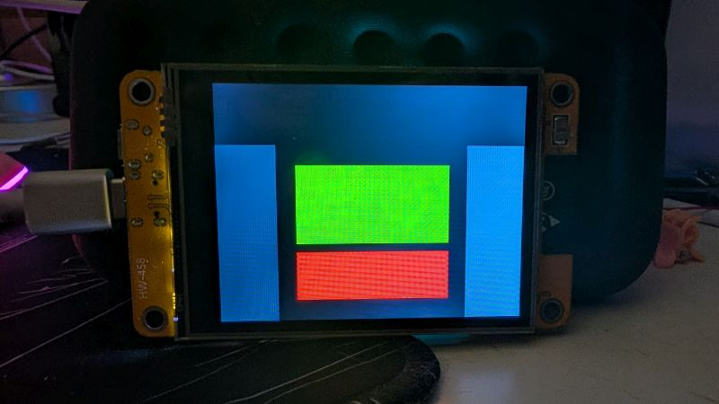
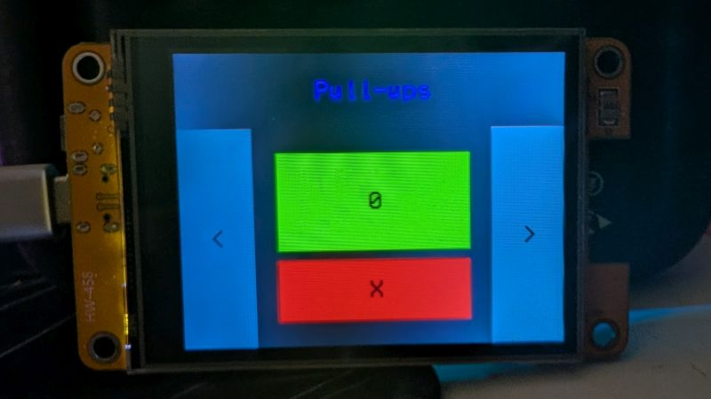

# What am I building?

To me, making a program is essentially putting together a lot of small parts to make something bigger and cooler, kind of like Lego. I find it's best to know what you want your program to do before you get started, that way you don't get too far off track or program yourself into a corner.

So, what do I need for this program?

I want a program that keeps track of how many pull-ups (and other exercises) I do throughout the day, sounds an alarm 45 minutes to an hour after I complete a set, saves all the data, and makes it available as a web page. I don't usually write out all that I need it to do, but in this case I will so I can come back to this later or keep it up on my screen as I'm working out ideas.

* Keep track of exercises
* Sound alarm
* Save data
* Web interface

From here, I like to break things down even further so I better know what tools I'm going to need or skills I'm going to have to learn.

## Keep track of exercises

Since I know I want to keep track of more than one exercise, I'll need a way to switch between exercises, so I'll need at least one UI element to do that. I'll need a way to display the current exercise which will be another UI element. I'll need a way to display my current total, a way to increment my total, and a way to decrement my total if I accidentally increment it. This takes care of the basics of my UI.

Once I have a general idea of what I'll need on-screen, I like to physically draw it out.


None of this is set in stone. Since I know the dimensions of the CYD, I also like to pencil in possible pixel values for the different elements. Once I have a rough idea for what I want, I make a quick and dirty program so I can see my ideas in action.



This isn't bad, so I'm going to take it a step further and see [what it looks like](rep-counter-01.ino) with some content in it.



I'm not crazy about the colors, or some of the shapes or presentations, but this is a good start. I don't want to get bogged down in the minutiae of UI design at this point, so I'm going to focus on functionality first. Let's start with incrementing and decrementing the reps.

Right now, all of my code is in the `setup()` function, but I'm going to put a lot of that in the `loop()` function similar to how I set up [this tone program](../../../example-programs/99-just-for-fun/hello-tone-two-tones.ino). Here's the way I think about it. I'm going to save the global scope for things that I need everywhere, basically just the BB_SPI_LCD object. `setup()` is just going to be where I get things ready to run, like initiallizing the display and the touch interface. `loop()` is where the everything is going to happen. I'm going to use it like the operating scope of my program, and I don't currently forsee taking advantage of its loop. In fact, I'm going to put most of the logic inside a while loop inside of the `loop()` function. [Here's what that looks like](rep-counter-02.ino) with a quick refactor.

Next up, if I want to count pull-ups, I need a way to store the value, so I need a variable. For now, I'm going to call it <var>`pullUpCount`</var> but that will likely change in the future. Remember, you're not making a finished production-ready product at this point. This is just a first draft.

Next, I want my <var>`repUp`</var> and <var>`repDown`</var> buttons to change the number of reps. I'm going to go about this in the same way I did with my tone program I mentioned earlier. I will have an if statement listening for touches and then I will check if those touches were on either of my buttons. If so, I will change the value of <var>`pullUpCount`</var>. 

[Here's my first implementation](rep-counter-03-first-count.ino) along with some comments on what things are doing. 

Now I'd like to implement changing the exercise and I can already feel the complexity growing. The behavior I want is to push the left or right button and have the exercises cycle endlessly no matter which direction I push. In order to do that I'm going to need at least one array. 

As I see it, there are two ways to go about this. I could have multiple arrays or one array and a struct to hold related data. Using multiple arrays I would have one array for the name to display on screen and one for the count of reps, eg

```C++
exercise_name[0] = "Pull-ups";
exercise_count[0] = 0;

exercise_name[1] = "Push-ups";
exercise_count[1] = 0;
```

The other way to go about it (and how I'm going to approach it) is to make a struct for all the data associated with a single exercise, and then make an array of that, eg

```C++
struct Exercise_data {
  char *name;
  int count;
};

Exercise_data exercises[2];
```

This second one will require more overhead to set up, but it will make my life easier when using it. But before I jump in and start coding this new feature, I want to stop and think about what I'll need to make it work. Other than building the struct and adding the buttons to my if chain, I'm going to need a variable to keep track of what exercise I'm currently viewing. I'm also going to need to reset that variable to 0 when I go past the last index of my exercise array. And I'll have to implement these new variables into what I've already written.

Another thing I like to think about ahead of time when adding a new UI element (in this case the left and right buttons) is what needs to happen when it is pressed. If I take the time to do this step, it usually saves me a lot of hassle trying to solve a very simple problem that I should have solved at the outset. So what needs doing in this case?

* Update the current exercise counter variable
  * if the counter goes under 0 or over the length then it needs to be reset to either the last index or 0, respectively
* Update the displayed exercise
* Update the displayed count

Honestly, the trickiest bit out of all of this is making sure the variable for keeping track of the current index overflows/underflows correctly. 

And with what I have now, I have basically taken care of my first bullet point: Keep track of exercises. But, just looking at my other features, I can see some things I've missed. Specifically, if I'm going to have an alarm to remind me to do pull-ups at regular intervals, should I have a count down or a clock? Or should it just be a surprise? Should I have a button to start a countdown to my next set of pull-ups? I literally have to go back to the drawing board and sketch out some UIs to see what I like.

What's more, as I've been putting this together I'm realizing I need things like the ability for a user to input an exercise, or have screens besides just the rep count screen (maybe my alarm will be on a different screen and not integrated with the rep count UI). That means that I need to start [thinking about UX flow](../02-ui-ux-home-screen/), how I or someone else will navigate the different parts of the program.