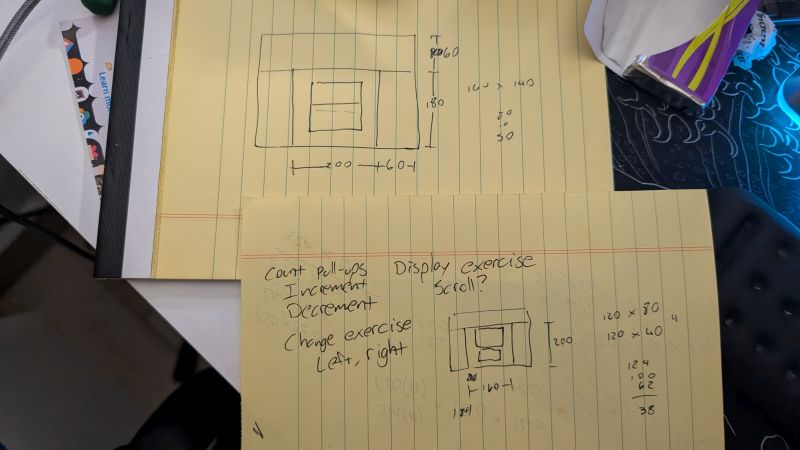

# What am I building?

To me, making a program is essentially putting together a lot of small parts to make something bigger and cooler, kind of like Lego. I find it's best to know what you want your program to do before you get started, that way you don't get too far off track or program yourself into a corner.

So, what do I need for this program?

I want a program that keeps track of how many pull-ups (and other exercises) I do throughout the day, sounds an alarm 45 minutes to an hour after I complete a set, saves all the data, and makes it available as a web page. I don't usually write out all that I need it to do, but in this case I will so I can come back to this later or keep it up on my screen as I'm working out ideas.

* Keep track of exercises
* Sound alarm
* Save data
* Web interface

From here, I like to break things down even further so I better know what tools I'm going to need or skills I'm going to have to learn.

## Keep track of exercises

Since I know I want to keep track of more than one exercise, I'll need a way to switch between exercises, so I'll need at least one UI element to do that. I'll need a way to display the current exercise which will be another UI element. I'll need a way to display my current total, a way to increment my total, and a way to decrement my total if I accidentally increment it. This takes care of the basics of my UI.

Once I have a general idea of what I'll need on-screen, I like to physically draw it out.

None of this is set in stone. Since I know the dimensions of the CYD, I also like to pencil in possible pixel values for the different elements. Once I have a rough idea for what I want, I make a quick and dirty program so I can see my ideas in action.

This isn't bad, so I'm going to take it a step further and see what it looks like with some content in it.

