# User Interface and User eXperience

UI and UX are really big umbrellas for a lot of small details that coalesce into the vibe of your program. This is the kind of thing I always have in the back of my mind, but until I pull it out into the light, I usually don't realize how amorphous my ideas are. But, now that I've demonstrated the feasability of my idea by making a working prototype, it's a good time to put a little polish on my UI/UX. Plus, making it nice to look at will keep me motivated to continue adding features.

Before I tinker with the UI anymore, I want to figure out the scope of my program. I know that at its core, it's a rep counter, but that leaves a lot of things left unsaid. For instance, what am I counting reps of? *I'm* planning on counting pull-ups and push-ups, but there's a lot of joy to be had in making something for other people, even if noone ever uses it. What I'm getting at is, what if people want to use the program, but they don't want to track pull-ups? Should I expect any other users of this program to edit my source code or save files to make it work for them? Lots of developers take that approach but I'd rather make something more user-friendly. As such, I'm going to need a way for users to add their own exercises which means text input.

**Feature List**

* Add exercises
  * Text input/on-screen keyboard

Since the exercises won't be hard-coded into the source code and they will be added after compile, that means they'll be saved into an external file on an SD card (CYD doesn't have EEPROM/onboard memory). But what happens if there is no file present? What should the start-up behavior of my program be? Will it start up to a home screen, a root from which other functionalities branch out? Or should it start to the rep-counting UI I've already built? I've decided that I want to have text input which means an on-screen keyboard which means that the rep-counting screen won't be the only one which means I need a way to exit the rep-counting screen. 

**Rep-counter UI Changes**

* Exit screen

But if I exit the rep-counting screen/page/interface, where does that take me? I think I need a home screen. Having decided that, I can get a better idea of my program's start-up behavior. 

**Feature List**

* Add exercises (this should probably be a screen)
  * Text input/on-screen keyboard
* Home screen

> [!NOTE]
> Having settled on two new screens at this point, I'm thinking about how to build them in the back of my mind. I'm not prepared to start implementing them just yet, but I'm imagining how they should behave and mentally trying out different ideas.

People using this app may not want the same alarm interval that I do, so there should be a way to change that.

**Feature List**

* Add exercise screen
  * Text input/on-screen keyboard
* Home screen
* Alarm screen

Since this program is supposed to connect to the user's Wi-Fi network, they need to have a way to input their network and password (looks like I'll have more than one use for my keyboard).

**Feature List**

* Add exercise screen
  * Text input/on-screen keyboard
* Home screen
* Alarm screen
* Wi-Fi screen

Okay, so this has basically turned into a list of different interfaces. I'm going to reorganize this so it's more useful

**Screens List**

* Home screen
  * Rep counter screen
  * Add/delete exercise screen
  * Alarm screen
  * Wi-Fi screen

This actually helps me envision what I'm making better and helps order my thoughts. Normally I write this kind of thing down on paper but I'm going digital for today. 

These screens pretty much cover all of the primary needs I had for this that I laid out in the previous post: count reps, sound alarm, save data, broadcast to web. So, instead of engaging in the tempting passtime of feature bloat, I'm going to sketch out some ideas for how I want my home page to look and behave.
 
I love books and most of the programs I make usually have a home page that resembles the title page of a book. Likewise I love old video games and they all have cool start screens with a prominent title, so my program needs a name. That's a whole other bag of worms, but knowing I want that as a design element helps me design the rest of the home page.

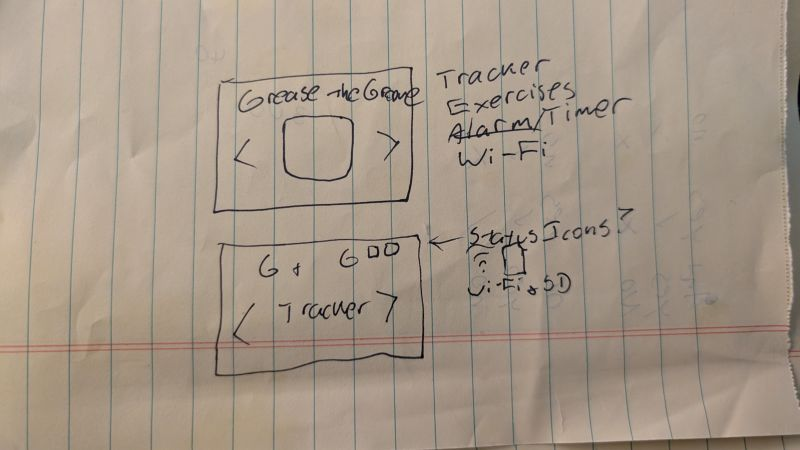

Okay, my working title is "Grease the Groove" since that's the protocol I'm doing. At a minimum, I'm going to have four elements on the home screen: the title, left and right buttons, and the selected mode. You can already see that the mode selection is going to work very similarly to the exercise selection of my first prototype.

Now I'm going to make a working home screen. Since I have to manually place where I want my elements to go, I sketch out where I want things to be and mark off pixels.

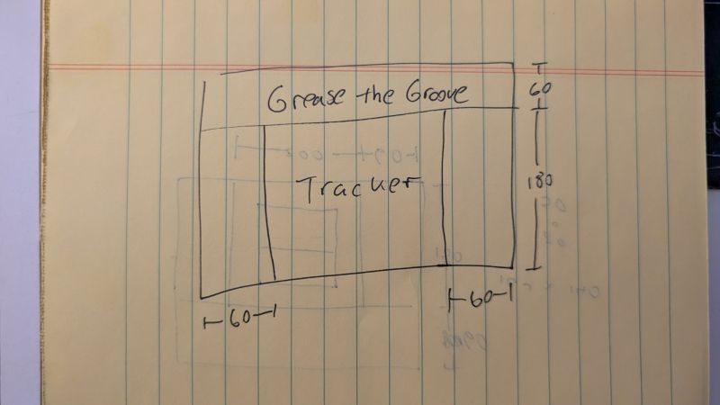

And I think I'm going to toy with making the UI more minimal, just to get a vibe check.

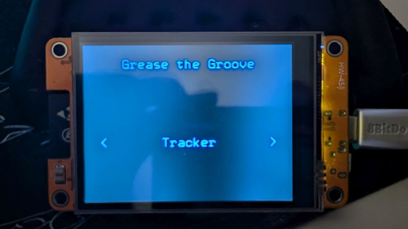

Too be honest, I think that's too minimalist. And I think I want to try an alternative typeface for the title. I'm also going to enlarge those angle brackets to see how that looks, but I think I may have to refactor my Button struct because I want the outline of a rectangle or something.

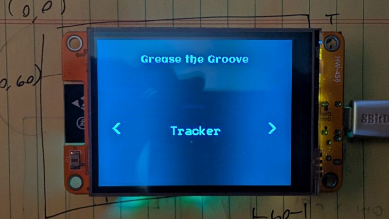

Okay, I dig the typeface but this needs some work. I'm going to find a way to incorporate rounded corners and rectangle outlines into my Button struct. I think that will add some weight to everything. I also need to find a way to better integrate GFX fonts into my Button because I had to tweak it to get this to work ><

I know that BB_SPI_LCD has both rounded rectangles and line drawing of rectangles/rounded rectangles, so I'm going to play with that and see what I can get. I think I'm going to have to draw overlapping rectangles because `drawRect()` only draws with lines 1 pixel wide. 

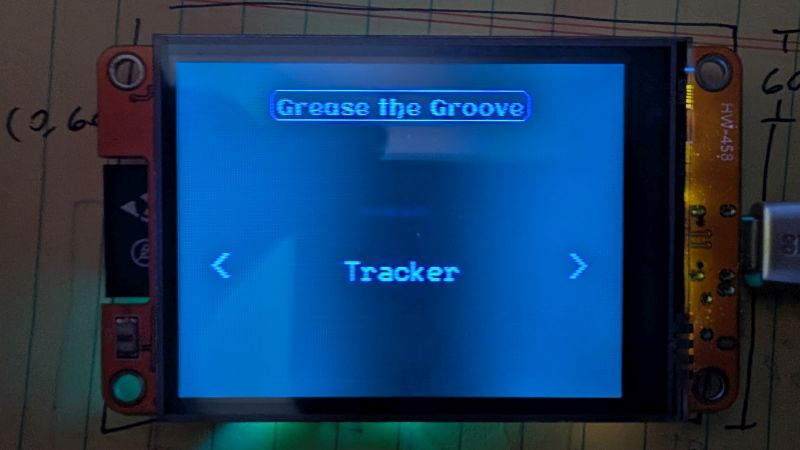

Okay, that actually looks pretty cool. I need to give it a little bit more space but I like that. 

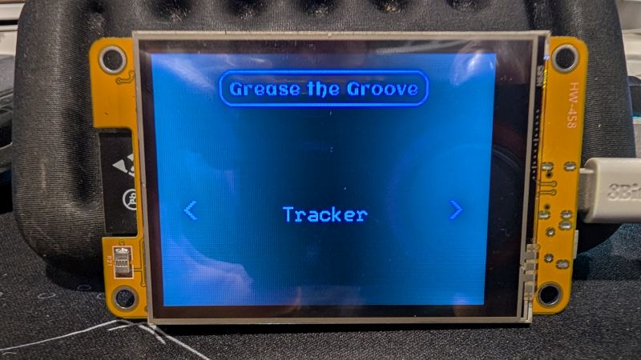

Alright, I'm on to something good here. I made a struct method to draw the box, and I can draw more than one to increase the thickness. Here's the metod I ended up writing:

```C++
void textBox(int pad, int xOff, int yOff, int rad, int color, BB_SPI_LCD *dest) {
  int bw = tw + (pad * 2);
  int bh = th + (pad * 2);
  int bx = tx - pad + xOff;
  int by = (font > -1) ? (ty - pad) : (ty - pad - th);
  by += yOff;
  dest->drawRoundRect(bx, by, bw, bh, rad, color);
}
```

I could have put all that math inside my `drawRoundRect()` method call but putting it outside of the arguments makes it all easier for me to grasp if and when I come back later. I'm thinking of adding a thickness parameter then putting `drawRoundRect()` inside a for loop. But, more importantly, I need to make the bottom part of my home screen look better. I'm going to temporarily add some color to my different buttons so I can have a better idea of my proportions.

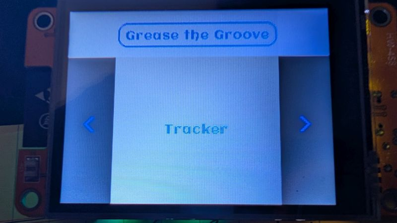

I think looking at it like this emphasizes just how much empty space there is, particularly around the mode name. I'm going to beef that up and see how it looks on all black.

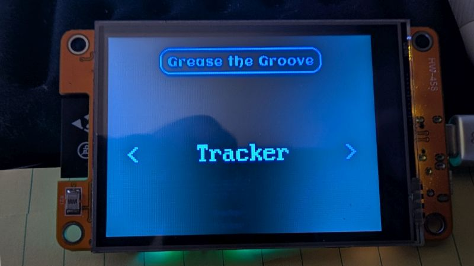

That's a lot better, but how does it hold up to longer text? 

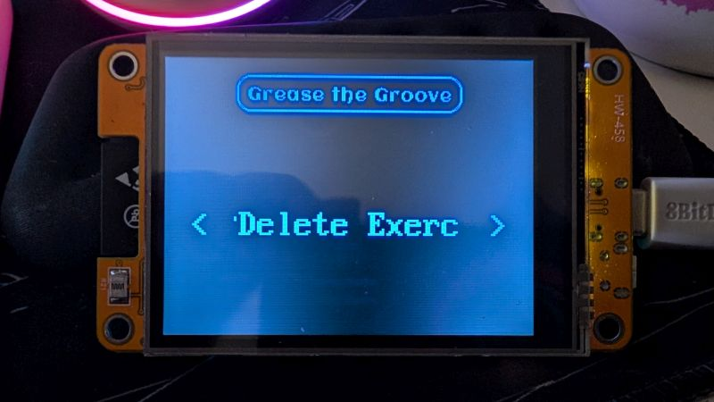

It doesn't. What about if we do a line break?

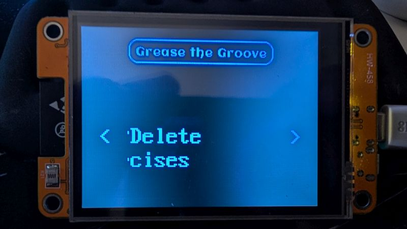

The issue is how I have the `text()` method implemented in my Button struct, so I either have to add that feature in, settle for a smaller font, or change the wording for that mode. I'm going to try the simplest solution first: change the wording.

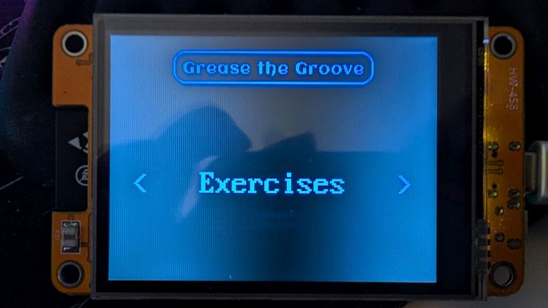

Honestly, that works for me.