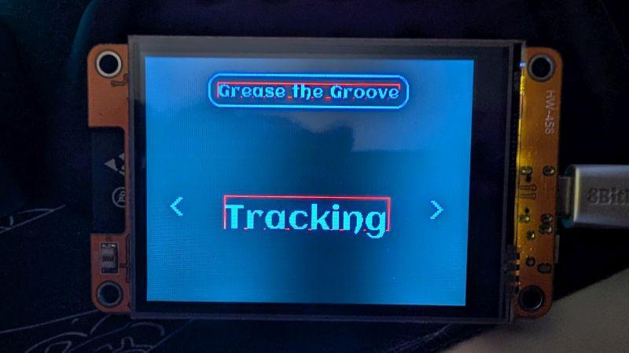

# Making a better object

My Button struct has served me well, but I'm finding I use it for a lot more than just buttons, so I want to rebuild it with some broader functionality in mind. 

First of all, I'm using it for a lot more than just buttons. I'm basically using it to define an area of the screen and draw to it. Sometimes I'm using that area as a button, but other times it's just an easy way to draw to the display. I also want to use it to have animated text and responsive behavior. Instead of adding these features in with duct tape and bubble gum, I want them to be considered from the ground up.

I think the core of what I want involves defining an object of a set size that can then be placed on the screen, I'm going to call it a Block.

```C++
struct Block {
  ...
};
```

My Block is going to have a width and a height:

```C++
struct Block {
  int w, h;
};
```

Now I have to make some choices. One thing I like about my initial approach was how the Button object created a sprite of itself so that it could be drawn to the display quickly. My approach was to make a rectangular sprite of a single color for the button, but then any text would be drawn on top of that. I think I may want to instead draw my sprites with the text and anything else, and then draw that to the screen. So I'm going to keep my constructor simple, but then add methods for drawing to the Block's sprite and another method for drawing the sprite to the screen. [Here's my first pass at it](block-struct-01.ino), just handling text.

I still need a way to erase and update text. Maybe I can add something to my `text()` method that erases any text that may already be there before putting new text in. The alternative is a separate method to wipe it before writing something new. Here's what I have right now:

```C++
void text(char *text, int _textColor) {

  if (font > -1) {
    sprite.setFont(font);
  } else {
    sprite.setFreeFont(gfx);
  }

  int16_t _x1, _y1;
  uint16_t _tw, _th;
  sprite.getTextBounds(text, 0, 0, &_x1, &_y1, &_tw, &_th);

  int x = (sprite.width() / 2) - (_tw / 2);
  int y = (_y1 == 0) ? (sprite.height() / 2) - (_th / 2) : (sprite.height() / 2) + (_th / 2);

  tw = _tw;
  th = _th;
  tx = x;
  ty = y;

  sprite.setTextColor(_textColor, color);
  sprite.setCursor(x, y);
  sprite.println(text);
}
```

I think I'm going to use a sentinal value. What I want to do is check the value of <var>`tw`</var> or <var>`th`</var> to see if one of them has been assigned a value. If they have, then I can assume text is already present and wipe it. But in C++ there's no direct method to check if an instantiated variable has been assigned a value. When I make a new instance of a Block, it makes a bunch of new variables/attributes but it doesn't assign a value to most of them. Instead they get assigned a memory block and their value is whatever junk memory is leftover in the blocks they were assigned. So what I'm going to do is assign an impossible value to my <var>`tw`</var> variable. I know that the width of my onscreen text must be a positive integer, so I'm going to initialize it to -1. In other words, if <var>`tw`</var> is -1, there's nothing to erase, but if it's any other value, there's text to erase.

This is pretty easy to fix:

```C++
if (tw > -1) {
  sprite.fillRect(tx, ty, tw, th, color);
}
```

I can drop that in at the start of the method and correct a bug a little lower down: I need to change this line:

```C++
ty = y;
```

to

```C++
ty = (_y1 == 0) ? y : (y - th);
```

Basically, because GFX typefaces render from the bottom left, I need to adjust this value to compensate for that. Putting everything else in at this point is pretty trivial, so I'm going to set up working left and right buttons on this just so I can see everything loop through. [Here's the Block object I have so far](block-struck-02.ino).


Ugh. I didn't want a new problem to solve but apparently I have a misunderstanding of how the BB_SPI_LCD `getTextBounds()` method works because I'm not properly erasing all my text. And this is why you test early and often so you find these bugs soon enough that you have a general idea of where to look for them. 

I don't know exactly what's happening but I suspect that `getTextBounds()` doesn't take into account the descenders on a glyph because that's the bit that's persisting between my text wipes. 



Nope, the problem is my understanding. `getTextBounds()` absolutely accounts for the descenders. See how the red box representing my computed text area is as big as the text, but is aligned to the baseline, not the lowest part of the "g"? I've been using the bounding box to determine my initial cursor position which is why my strings that have glyphs with descenders look a little low. I can calculate the difference between the baseline and the deepest descender to fix it though. Then I can use that offset to put all of my strings on the same baseline, regardless of descenders, and properly place the bounding box. Ugh. My brain hurts after staring at the problem and figuring out the solution >< I recommend taking a break after squashing a bug like this.